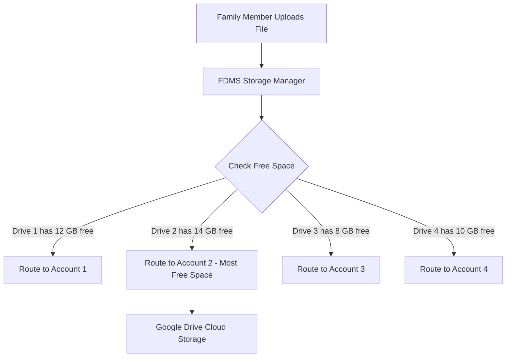

# 🌐 Google Drive Integration & Multi-Account Pooling Guide

This guide explains **who** can connect Google Drive accounts, **how** to set up Google Cloud credentials, and the **step-by-step process** to link multiple Google Drive accounts (e.g., 4 family members = 60 GB pooled cloud storage).

---

## 👥 1. Who Can Connect Google Drive?

* **Family Admin (Required)**: Only users with the **Admin** role can access the **Cloud Storage Settings** page (`#/storage`) and link/unlink Google Drive accounts.
* **Family Members**: Regular family members do **not** need to configure anything. Once the Admin links the Google accounts and enables Google Drive mode, all members automatically share and upload to the pooled family vault.
* **Can you connect multiple Google accounts?**: **YES**. The Admin can link as many personal Google Drive accounts as desired (e.g., Dad's, Mom's, Son's, Daughter's accounts). FDMS aggregates their storage quotas together and balances files across all accounts automatically.

---

## 🛠️ 2. Step 1: Google Cloud Console Configuration (One-Time Setup)

To allow FDMS to communicate with Google Drive, you must create free OAuth2 credentials in Google Cloud Console.

### A. Create Project & Enable Drive API
1. Open the **[Google Cloud Console](https://console.cloud.google.com/)**.
2. Click the project dropdown at the top and select **New Project**. Name it `FDMS Family Vault` and click **Create**.
3. In the left navigation menu, go to **APIs & Services** > **Library**.
4. Search for **Google Drive API**, click on it, and click **Enable**.

### B. Configure OAuth Consent Screen
1. In the left menu, go to **APIs & Services** > **OAuth consent screen**.
2. Select User Type: **External** and click **Create**.
3. Fill in:
   - **App Name**: `Family Document Vault`
   - **User Support Email**: Your Gmail address.
   - **Developer Contact Information**: Your Gmail address.
4. Click **Save and Continue**.
5. On the **Scopes** page:
   - Click **Add or Remove Scopes**.
   - Search for and select: `https://www.googleapis.com/auth/drive.file`
   *(This scope is restricted and safe: it only allows the app to view and manage files it creates itself).*
   - Click **Update** then **Save and Continue**.
6. On the **Test Users** page (*Crucial Step*):
   - Click **+ Add Users**.
   - Enter all the Gmail addresses of the family members whose Google Drive accounts you want to connect (e.g., `member1@gmail.com`, `member2@gmail.com`, `member3@gmail.com`, `member4@gmail.com`).
   - Click **Save and Continue**.

### C. Create OAuth Client ID Credentials
1. In the left menu, go to **APIs & Services** > **Credentials**.
2. Click **+ Create Credentials** > **OAuth client ID**.
3. Set **Application type**: `Web application`.
4. Set **Name**: `FDMS Web Client`.
5. Under **Authorized redirect URIs**, click **+ Add URI** and enter:
   - For Local Testing: `http://localhost:8000/api/storage/oauth2callback`
   - For Production (e.g., Render/Custom Domain): `https://your-domain.com/api/storage/oauth2callback`
6. Click **Create**.
7. A popup will show your:
   - **Client ID** (e.g., `123456789-abc.apps.googleusercontent.com`)
   - **Client Secret** (e.g., `GOCSPX-xxxxxxxxxxxxxx`)
   
> 💡 *Keep this Client ID and Client Secret handy for the next step.*

---

## 🔗 3. Step 2: Connecting Google Drive Accounts in FDMS

### Connecting Account #1 (e.g., Admin's Drive)
1. Log in to FDMS as **Family Admin**.
2. Click on **Cloud Storage Settings** in the sidebar navigation (or go to `#/storage`).
3. Scroll to the **Connected Google Accounts** section.
4. Enter your **Google Client ID** and **Google Client Secret** in the inputs.
5. Click **Connect New Google Drive Account**.
6. You will be redirected to the Google Sign-in page:
   - Select the 1st Google account.
   - If you see a *"Google hasn't verified this app"* warning (normal for test apps), click **Advanced** > **Go to Family Document Vault (unsafe)**.
   - Check the permission checkbox allowing the app to manage files and click **Continue**.
7. You will be redirected back to FDMS with a success notification: *"Google Drive account linked successfully!"*.

---

### Connecting Account #2, #3, and #4 (Family Multi-Drive Pooling)
To add the remaining family members' Google accounts:
1. In the same **Cloud Storage Settings** page, look at the **Connected Google Accounts** section.
2. The Client ID is already remembered. Re-enter the **Client Secret** if prompted.
3. Click **Connect New Google Drive Account**.
4. When Google opens the account chooser, click **"Use another account"** or select the 2nd family member's Google account.
5. Grant permissions and click **Continue**.
6. Repeat the process for the 3rd and 4th family members' Google accounts.

---

## 🏷️ 4. Step 3: Labeling and Managing Accounts

Once all accounts are linked, you will see account cards for each connected Google Drive:

1. **Add Nicknames/Labels**:
   - Click **Edit Label** on each card.
   - Assign friendly names like `"Dad's Drive (15 GB)"`, `"Mom's Drive (15 GB)"`, `"Child 1 Drive (15 GB)"`.
2. **Check Capacity**:
   - Each card displays real-time free/used space.
   - The aggregate progress bar at the top displays the total combined capacity (e.g., **Used 0 B of 60 GB**).

---

## 🚀 5. Step 4: Activating Google Drive Storage Mode

1. On the **Cloud Storage Settings** page, locate **Active Storage Mode Selection**.
2. Select the radio button: **Google Drive (Multi-Account Pooling)**.
3. Click **Apply Storage Mode Settings**.
4. The status badge at the top will switch to `ACTIVE` with `"Google Drive Pooling Active (4 connected accounts)"`.

---

## ⚙️ 6. How Storage Routing & Uploads Work Behind the Scenes

* **Smart Load Balancing**: Every time a file is uploaded, the system queries the free space across all active Google accounts and routes the upload to whichever account currently has the most available room.
* **Automatic Fallover**: If one account fills up or has an error, uploads automatically divert to the other connected accounts without interrupting the users.
* **Safe Disconnect & Background Migration**: If you ever click **Disconnect** on an account, FDMS keeps the files safe and migrates them in the background to the other remaining accounts before removal.

---

## ❓ 7. Troubleshooting & FAQ

| Problem | Cause | Solution |
| :--- | :--- | :--- |
| **"Access blocked: App has not completed verification"** | The Google account is not added as a Test User. | Go to Google Cloud Console > **OAuth consent screen** > **Test Users** > Add the email address. |
| **"Re-authentication Required"** badge on card | OAuth token was revoked or expired. | Click the **Re-authenticate** button on the account card to refresh access. |
| **Website shows Local Storage** | Active mode has not been applied. | Go to Storage Settings, select **Google Drive**, and click **Apply Storage Mode Settings**. |
