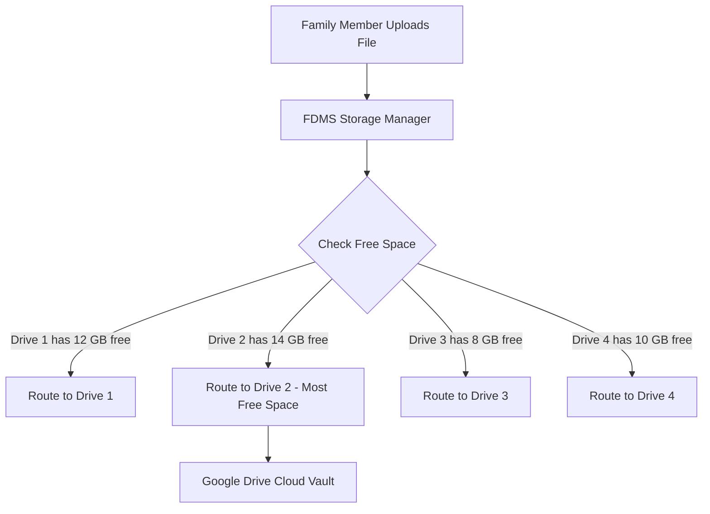

# 🌐 Simplified Google Drive Integration & Multi-Account Pooling Guide

This guide explains **how multi-account pooling works**, **how to configure Google Cloud OAuth once**, and **how family members can link their free Google Drive accounts with 1 click** (e.g., 4 family members × 15 GB = **60 GB pooled family vault**).

---

## 👥 1. Who Can Connect Google Drive?

* **Family Admin**: Configures Google Cloud credentials once (or sets them in `.env`), manages storage mode, and sends invite links.
* **Family Members (Self-Service)**: Any family member can contribute their personal Google Drive (+15 GB) directly from their **Profile** or **Cloud Storage** page (`#/storage`) with 1 click.
* **Pooled Multi-Drive Sharing**: FDMS automatically combines the storage capacity of all connected drives into a unified family vault and balances file uploads across all accounts.

---

## 🛠️ 2. Step 1: Google Cloud Console Configuration (One-Time Setup)

To enable 1-click Google Drive linking for your family, create OAuth2 credentials in Google Cloud Console.

### A. Create Project & Enable Drive API
1. Open the **[Google Cloud Console](https://console.cloud.google.com/)**.
2. Click the project dropdown at the top and select **New Project**. Name it `FDMS Family Vault` and click **Create**.
3. In the left navigation menu, go to **APIs & Services** > **Library**.
4. Search for **Google Drive API**, click on it, and click **Enable**.

### B. Configure OAuth Consent Screen
1. In the left menu, go to **APIs & Services** > **OAuth consent screen**.
2. Select User Type: **External** and click **Create**.
3. Fill in:
   - **App Name**: `Family Document Vault`
   - **User Support Email**: Your Gmail address.
   - **Developer Contact Information**: Your Gmail address.
4. Click **Save and Continue**.
5. On the **Scopes** page:
   - Click **Add or Remove Scopes**.
   - Select: `https://www.googleapis.com/auth/drive.file`
   *(This scope is restricted and safe: it only allows the app to view and manage files it creates itself).*
   - Click **Update** then **Save and Continue**.
6. **Publishing Status (Critical for Permanent Access & Unlimited Families)**:
   - Go to **OAuth consent screen** overview.
   - Click **`PUBLISH APP`** and confirm.
   - **Why Publish?**: In Testing mode, Google limits you to 100 test users and revokes refresh tokens every 7 days. Setting the app to **In Production / Published** removes the 100-user limit, allows unlimited family members to connect, and prevents token expiration!

### C. Create OAuth Client ID Credentials
1. In the left menu, go to **APIs & Services** > **Credentials**.
2. Click **+ Create Credentials** > **OAuth client ID**.
3. Set **Application type**: `Web application`.
4. Set **Name**: `FDMS Web Client`.
5. Under **Authorized redirect URIs**, click **+ Add URI** and enter your backend callback:
   - For Local Testing: `http://localhost:8000/api/storage/oauth2callback`
   - For Production (Render / Custom Domain): `https://your-domain.com/api/storage/oauth2callback`
6. Click **Create**.
7. Click **DOWNLOAD JSON** or copy your **Client ID** and **Client Secret**.

---

## ⚡ 3. Step 2: Super-Fast Setup in FDMS

### Method A: Server-Level Pre-Configuration (Recommended)
Set the keys in your backend `.env` file or hosting environment variables:
```env
GOOGLE_CLIENT_ID="your-client-id.apps.googleusercontent.com"
GOOGLE_CLIENT_SECRET="GOCSPX-your-client-secret"
```
> 🎉 **Result**: Family members and admins will **never** have to copy/paste credentials. They will simply see a single **"🔵 Connect Google Drive (+15 GB)"** button!

---

### Method B: Drag & Drop `credentials.json` in FDMS
If you are running the app without `.env` pre-configuration:
1. Open FDMS as Admin and go to **Cloud Storage & Quotas** (`#/storage`).
2. Click **API Credentials** in the top right.
3. Drag & drop the downloaded `credentials.json` file from Google Cloud Console onto the dropzone (or select it).
4. Client ID & Secret are instantly loaded. Click **Save & Connect Account**.

---

## 🔗 4. Step 3: Adding Family Member Drives (+15 GB Each)

### Option 1: Shareable Invite Link & WhatsApp (Easiest)
1. On the **Cloud Storage Settings** page, click **Invite Family Drives**.
2. Click **Share on WhatsApp** or **Copy Link**.
3. Send the link to your family members.
4. When they open FDMS on their phone/laptop, they tap **"Connect My Google Drive (+15 GB)"** and approve Google Sign-In.
5. Their 15 GB quota is immediately added to the family vault!

### Option 2: Connecting Directly in Member Profile
1. Each family member logs into FDMS.
2. Go to **Profile Settings** (`#/profile`) or **Storage Settings** (`#/storage`).
3. Click **Connect My Google Drive (+15 GB)**.
4. Authenticate with their personal Google account.

---

## 🏷️ 5. Managing Accounts & Quota

1. **Member Attribution**: Each connected drive displays the name and avatar of the family member who contributed it.
2. **Custom Labels**: Click **Edit Label** to assign names like `"Dad's Drive (15 GB)"`, `"Mom's Work Drive (15 GB)"`.
3. **Live Quota Progress**: The top hero card visualizes the pooled capacity (e.g., **Used 2.4 GB of 60 GB**) with breakdown across images, PDFs, docs, and sheets.
4. **Auto-Mode Switch**: As soon as the first Google Drive is linked, Google Drive Pooling mode is automatically activated.

---

## ⚙️ 6. How Storage Routing & Uploads Work



* **Smart Load Balancing**: Every upload routes to the drive with the most available free space.
* **Zero Disruption Migration**: If an account is disconnected, files are safely migrated to other family drives in the background before removal.

---

## ❓ 7. Troubleshooting & FAQ

| Problem | Cause | Solution |
| :--- | :--- | :--- |
| **"Access blocked: App has not completed verification"** | App is in Testing mode and user email is not in Test Users. | Go to Google Cloud Console > **OAuth consent screen** > Click **`PUBLISH APP`** to allow all family members. |
| **"Re-authentication Required"** | OAuth token expired after 7 days (Testing mode). | Publish the app in Google Cloud Console so tokens remain permanent. |
| **Redirect URI Mismatch** | Google Cloud Console URI does not match current domain. | In Google Cloud Credentials, add `http://localhost:8000/api/storage/oauth2callback` or your production domain callback. |
