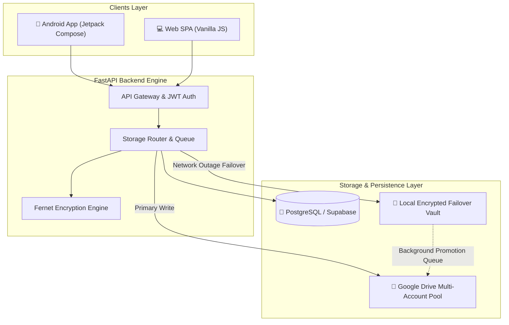

<div align="center">

# 📱 FamDoc — Family Keepsake & Document Management Platform

<p align="center">
  
  
  
  
  
  
</p>

<p align="center">
  <b>Enterprise-Grade, Resilient Family Vault with Native Android & FastAPI Multi-Account Cloud Storage</b>
</p>

<p align="center">
  
</p>

</div>

---

## 🌟 Overview

**FamDoc** (Family Document Management System) is an end-to-end document and digital keepsake platform designed specifically for families. It solves cloud storage limits and fragmentation by aggregating multiple Google Drive accounts into a unified, secure storage pool, backed by a local failover cache and a native Android mobile experience.

---

## ✨ Key Capabilities

- 🔄 **Dual-Tier Resilient Storage Architecture:** Direct uploads stream to pooled Google Drive accounts. If cloud limits or network outages occur, files seamlessly buffer to a local encrypted disk vault and auto-promote to the cloud once reconnected.
- 📱 **Native Android Application (Kotlin + Jetpack Compose):** 
  - Material Design 3 theme with dynamic color adaptability.
  - Biometric authentication (Fingerprint / Face unlock via AndroidX Biometrics).
  - Offline-first cache: cached previews, background download manager, and instant search.
- 🔐 **Multi-Tenancy & Hardened Security:**
  - Role-based access control (Admin & Family Member profiles).
  - Single-session JWT authentication with SHA-256 vault codes.
  - Fernet symmetric encryption for OAuth credentials and sensitive metadata.
- ⚡ **Zero-Overhead Web SPA:** Lightweight, ultra-fast Vanilla JS frontend with responsive design tokens, drag-and-drop file upload queue, and full-screen document previewers.
- ☁️ **Production Deployable:** Ready for deployment on **Render** (FastAPI backend), **Vercel** (Frontend SPA), and **Supabase / PostgreSQL** (Database).

---

## 🏗️ Architecture Flow



---

## 📁 Repository Structure

```
FamDoc/
├── android/                   # Native Android application (Kotlin + Jetpack Compose)
│   ├── app/src/main/java/     # Compose UI, ViewModels, Repository, Biometrics
│   └── build.gradle.kts       # Gradle build configuration
├── backend/                   # FastAPI Backend Server
│   ├── app/
│   │   ├── api/               # API routes (auth, documents, vaults, accounts)
│   │   ├── core/              # Security, encryption, config, database sessions
│   │   ├── models/            # SQLAlchemy / Pydantic models
│   │   └── services/          # Google Drive pooling, storage failover, queues
│   ├── requirements.txt       # Python dependencies
│   └── main.py                # Server entry point
├── frontend/                  # Web Single Page Application (SPA)
│   ├── index.html             # Main web dashboard
│   ├── assets/                # CSS styling, icons, JavaScript modules
│   └── vercel.json            # Vercel deployment configuration
├── docs/                      # Technical specifications & API contracts
├── build_apk.bat              # One-click Android APK build script
├── install_debug.bat          # ADB debug install script
└── render.yaml                # Render cloud deployment blueprint
```

---

## 🚀 Getting Started

### 1. Backend Setup

```bash
cd backend
python -m venv venv
venv\Scripts\activate          # On Linux/macOS: source venv/bin/activate
pip install -r requirements.txt
python main.py
```
Backend will start on `http://localhost:8000` with Swagger docs available at `http://localhost:8000/docs`.

### 2. Android App Build

Ensure Android SDK / Android Studio is installed, then build debug APK:
```bash
./build_apk.bat
```

---

## 👨‍💻 Author

**Akshaysinh Rajput**
- 🌐 Portfolio: [portfolioakshay.in](https://portfolioakshay.in)
- 💼 LinkedIn: [Akshaysinh Rajput](https://www.linkedin.com/in/akshaysinh-rajput-8a575532b/)
- 🐙 GitHub: [@ra901625072-boop](https://github.com/ra901625072-boop)