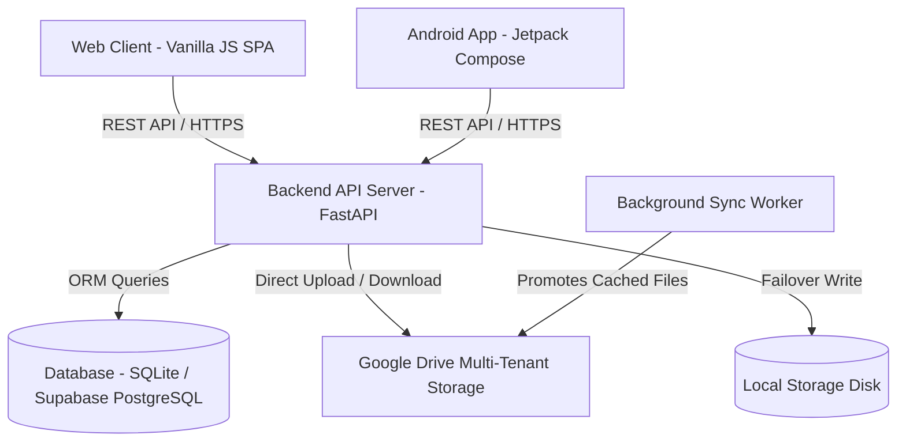

# 📁 FamDoc (Family Document Management System)

> **Enterprise-Grade, Resilient Family Keepsake & Document Management Platform**  
> Powered by FastAPI, Vanilla JS SPA, Native Android (Jetpack Compose), and Google Drive Multi-Tenant Cloud Storage.

---

## 🌟 Overview

**FamDoc** (also known as **FDMS**) is an end-to-end full-stack document and media management ecosystem designed specifically for families. It provides a secure, shared vault where family members can upload, organize, search, tag, share, and preview essential documents and precious memories.

### Key Highlights
- **🔄 Dual-Tier Resilient Storage:** Direct cloud write to Google Drive with automatic fallback to local disk storage and background auto-promotion.
- **🛡️ Secure Multi-Tenancy:** Role-based access control (Admin & Member), single-session JWT enforcement, encrypted OAuth credentials (Fernet encryption), and SHA-256 vault code protection.
- **📱 Native Android Application:** Modern Jetpack Compose UI, Material Design 3, Coroutine-based asynchronous networking, offline resilience, and biometric authentication.
- **⚡ Lightweight High-Performance Web SPA:** Zero-framework overhead Vanilla JS SPA with responsive CSS design tokens, real-time background queue indicators, and PDF/image previewers.
- **🚀 Production Ready:** Configured for automated deployment on **Render** (FastAPI backend), **Vercel** (Frontend SPA), and **Supabase / PostgreSQL** (Database).

---

## 🏛️ System Architecture



---

## 📂 Repository Directory Structure

```
FDMS-app/
├── README.md                      # Primary project overview & developer documentation hub
├── render.yaml                    # Render Cloud deployment blueprint
├── .gitignore                     # Multi-stack Git ignore rules
│
├── android/                       # Native Android Application (Kotlin + Jetpack Compose)
│   ├── app/
│   │   ├── src/main/java/com/famdoc/app/
│   │   │   ├── core/              # Config, Network, Security, Utilities
│   │   │   ├── data/              # Retrofit API, Models, Repositories
│   │   │   └── ui/                # Compose screens, ViewModels, Themes, Navigation
│   │   └── build.gradle.kts       # App module build configuration
│   ├── gradle/                    # Gradle wrapper files
│   ├── build.gradle.kts           # Root Gradle build script
│   ├── settings.gradle.kts        # Project settings & dependency repositories
│   └── gradlew.bat                # Windows Gradle wrapper launcher
│
├── backend/                       # Python FastAPI REST API Backend
│   ├── main.py                    # Server lifecycle, background workers & route registry
│   ├── config.py                  # Environment configurations & secret validation
│   ├── database.py                # SQLAlchemy engine, session management & auto-migrations
│   ├── models.py                  # Database ORM entity models
│   ├── schemas.py                 # Pydantic request/response validation schemas
│   ├── serializers.py             # Response transformers
│   ├── auth.py                    # JWT authentication & password hashing utilities
│   ├── cache.py                   # In-memory TTL caching layer
│   ├── logging_config.py          # Centralized logging setup
│   ├── requirements.txt           # Python package dependencies
│   ├── routers/                   # Modular API route controllers
│   ├── storage/                   # Multi-tenant storage engine (Google Drive & Local)
│   ├── utils/                     # Helper modules (audit, email, crypto, virus scan)
│   ├── scripts/                   # DB migrations and maintenance utilities
│   └── tests/                     # Automated pytest test suites
│
├── frontend/                      # Web Single-Page Application (SPA)
│   ├── index.html                 # SPA entry point & dynamic mounting container
│   ├── vercel.json                # Vercel deployment & proxy rewrites
│   ├── css/                       # Modular CSS design system & theme variables
│   ├── img/                       # Brand assets & vector logos
│   └── js/                        # Core API clients, sync managers & view controllers
│       ├── api.js                 # Unified REST client with session management
│       ├── app.js                 # Global app orchestrator
│       ├── router.js              # Hash-based SPA routing engine
│       ├── theme.js               # Dark/Light theme manager
│       ├── upload-manager.js      # Resilient file upload engine
│       ├── connection-manager.js  # Network status monitor
│       ├── background-manager.js  # Background sync manager
│       └── views/                 # View controllers (vault, dashboard, auth, storage, etc.)
│
├── docs/                          # Centralized Documentation
│   ├── SYSTEM_ARCHITECTURE.md     # Deep architecture breakdown, storage tiers, data flow
│   ├── SETUP_GUIDE.md             # Development environment setup guide
│   ├── DEPLOYMENT_GUIDE.md        # Production deployment (Render, Vercel, Supabase)
│   └── android/                   # Native Android Specific Documentation
│       ├── ARCHITECTURE.md        # Android MVVM & Compose architecture
│       ├── API_INTEGRATION.md     # REST API contract & endpoints for Android
│       ├── SETUP.md               # Android Studio, SDK & JDK setup guide
│       ├── BUILD.md               # Debug & Release APK/AAB build instructions
│       ├── RELEASE.md             # Keystore signing & Play Store release guide
│       ├── TESTING.md             # Android testing procedures
│       ├── MIGRATION_ANALYSIS.md  # Deep technical migration audit
│       └── MIGRATION_REPORT.md    # Final migration verification report
│
├── scripts/                       # Automation & Build Scripts
│   ├── setup_android.bat          # Verifies Android SDK, JDK 17 & platform tools
│   ├── build_apk.bat              # Compiles debug APK -> builds/debug/
│   ├── build_release.bat          # Compiles production release APK & AAB -> builds/release/
│   ├── install_debug.bat          # Installs debug APK onto connected device via ADB
│   └── clean_build.bat            # Cleans Gradle caches and build output folders
│
├── builds/                        # Compiled Android binaries (debug & release APKs)
└── local_vault/                   # Local file fallback storage directory
```

---

## 🚀 Quick Start Guide

### 1. Backend Service (FastAPI)

```bash
# Navigate to backend directory
cd backend

# Create and activate virtual environment (optional)
python -m venv venv
venv\Scripts\activate

# Install dependencies
pip install -r requirements.txt

# Start development server
uvicorn main:app --reload --host 127.0.0.1 --port 8000
```
API Documentation will be available at: `http://localhost:8000/docs`

---

### 2. Frontend Client (Web SPA)

When running the backend with `SERVE_FRONTEND=true` (the default in development), the frontend is automatically served directly by FastAPI at:
`http://localhost:8000/`

For standalone frontend development or Vercel preview:
```bash
# Simply serve the frontend folder with any static web server (e.g. live-server, http-server, or npx serve)
npx serve frontend -p 3000
```

---

### 3. Native Android App (FamDoc)

Ensure you have Android SDK and JDK 17 installed, then use the provided root or scripts batch files:

```bash
# 1. Verify Android build environment
scripts\setup_android.bat

# 2. Build Debug APK
scripts\build_apk.bat

# 3. Install on connected phone/emulator via ADB
scripts\install_debug.bat

# 4. Build Production Release (APK + AAB)
scripts\build_release.bat
```

Generated APKs are placed in:
- Debug: `builds/debug/FamDoc-debug.apk`
- Release: `builds/release/FamDoc-release.apk` and `builds/release/FamDoc-release.aab`

---

## 📚 Documentation Index

| Topic | Document | Description |
|---|---|---|
| **System Architecture** | [docs/SYSTEM_ARCHITECTURE.md](docs/SYSTEM_ARCHITECTURE.md) | Comprehensive architecture, database schema, data dictionary, and storage flow |
| **Setup & Local Dev** | [docs/SETUP_GUIDE.md](docs/SETUP_GUIDE.md) | Step-by-step developer setup for Backend and Web |
| **Cloud Deployment** | [docs/DEPLOYMENT_GUIDE.md](docs/DEPLOYMENT_GUIDE.md) | Guide for deploying to Render, Vercel, and Supabase PostgreSQL |
| **Android Architecture** | [docs/android/ARCHITECTURE.md](docs/android/ARCHITECTURE.md) | Architecture blueprint for Kotlin Jetpack Compose app |
| **Android API Specs** | [docs/android/API_INTEGRATION.md](docs/android/API_INTEGRATION.md) | REST API endpoints, request/response formats for Android |
| **Android Setup** | [docs/android/SETUP.md](docs/android/SETUP.md) | Android SDK, JDK, and emulator configuration |
| **Android Build** | [docs/android/BUILD.md](docs/android/BUILD.md) | Build instructions for debug APKs |
| **Android Release** | [docs/android/RELEASE.md](docs/android/RELEASE.md) | Production Keystore signing and Play Store publishing |
| **Android Testing** | [docs/android/TESTING.md](docs/android/TESTING.md) | Unit and UI testing procedures |
| **Migration Analysis** | [docs/android/MIGRATION_ANALYSIS.md](docs/android/MIGRATION_ANALYSIS.md) | Detailed technical audit of web-to-Android migration |
| **Migration Report** | [docs/android/MIGRATION_REPORT.md](docs/android/MIGRATION_REPORT.md) | Final sign-off audit report for the native Android app |

---

## 🛠️ Automation & Helper Scripts

All build and deployment automation scripts are located in `scripts/` with convenience launchers in the root directory:

| Command | Target | Description |
|---|---|---|
| `build_apk.bat` | `scripts\build_apk.bat` | Compiles debug APK and outputs to `builds/debug/` |
| `build_release.bat` | `scripts\build_release.bat` | Compiles signed/unsigned release APK and AAB to `builds/release/` |
| `install_debug.bat` | `scripts\install_debug.bat` | Deploys `FamDoc-debug.apk` directly to an attached Android phone |
| `clean_build.bat` | `scripts\clean_build.bat` | Cleans Gradle build caches and output folders |
| `setup_android.bat` | `scripts\setup_android.bat` | Validates JDK, Android SDK, ADB, and writes `local.properties` |

---

## 🔒 Security & Privacy

- **Single Session Enforcement:** Validates `jti` claim to prevent concurrent conflicting logins.
- **Encrypted Storage Configs:** Fernet symmetric encryption prevents credential leaks.
- **Audit Logging:** Every administrative action, member addition, file upload, and deletion is recorded in immutable audit logs.
- **Input Validation:** Strict Pydantic models and parameterized SQLAlchemy queries prevent injection vulnerabilities.

---

## 📄 License
Private Family Project &copy; 2026. All rights reserved.
