# 📱 FamDoc — Visitor & User Guide
### *The Secure, Multi-Account Document Vault for Families*

---

## 📖 Quick Navigation

1. [Project Overview](#01--project-overview)
2. [The Problem](#02--the-problem)
3. [The Solution](#03--the-solution)
4. [Key Features & Benefits](#04--key-features--benefits)
5. [How It Was Created](#05--how-it-was-created)
6. [How It Works](#06--how-it-works)
7. [How to Use It](#07--how-to-use-it)
8. [Trust & Security](#08--trust--security)
9. [Real-World Use Cases](#09--real-world-use-cases)
10. [Key Benefits at a Glance](#10--key-benefits-at-a-glance)
11. [Current Status & Limitations](#11--current-status--limitations)
12. [Future Roadmap](#12--future-roadmap)
13. [Frequently Asked Questions (FAQ)](#13--frequently-asked-questions-faq)

---

## 01 — Project Overview

### What is FamDoc?

**FamDoc** (Family Document Management Platform) is a **private digital vault designed specifically for families**. It gives households a single, organized place to store, manage, and protect their most important paperwork — from birth certificates and medical records to property deeds, academic degrees, and family keepsakes.

Instead of paying for multiple cloud storage subscriptions or leaving documents scattered across loose drawers, personal phones, and separate email accounts, FamDoc unites the family under one shared, protected roof.

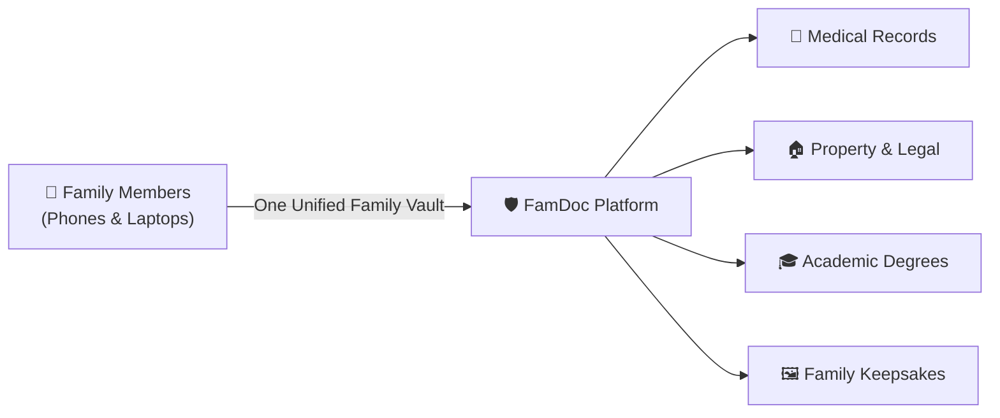

### 30-Second Summary

| Question | Answer |
|---|---|
| **What does it do?** | Provides a secure, family-wide digital locker for organizing and sharing documents. |
| **Who is it for?** | Families, households, caregivers, and individuals seeking a private alternative to fragmented personal drives. |
| **What makes it unique?** | It intelligently pools multiple free Google Drive accounts into one large family storage pool with an offline-resilient backup vault. |
| **How is it accessed?** | Through a modern, responsive web application and a native Android mobile application with biometric unlock. |

---

## 02 — The Problem

### What Families Struggle With Today

In most households, critical paperwork is managed haphazardly. When an emergency happens, or when tax season arrives, finding a specific document often turns into hours of frantic searching.

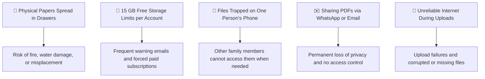

### The Real-World Breakdown

#### 1. Fragmented Storage Across Multiple Devices
* **Problem:** Dad has tax files on his work laptop. Mom has children's vaccination cards on her phone. Grandparents have physical property papers in an old folder.
* **Impact:** When someone urgently needs a file — such as at a hospital desk or government office — nobody knows who has it or where it is stored.

#### 2. Artificial Storage Limits & Recurring Costs
* **Problem:** Major cloud storage providers only offer 15 GB of free space per account. Families quickly run out of room and are nudged into perpetual monthly subscriptions.
* **Impact:** Households end up paying multiple recurring subscriptions across separate accounts or deleting memorable family archives to make space.

#### 3. Insecure Sharing Practices
* **Problem:** To share a passport scan or medical record with an accountant or doctor, people commonly send unencrypted PDFs via chat apps or email.
* **Impact:** Sensitive identity documents linger forever on third-party chat servers and recipients' downloads folders, creating serious privacy vulnerabilities.

#### 4. Upload Failures on Spotty Networks
* **Problem:** Traditional cloud storage apps fail immediately if your internet connection drops midway through uploading large files.
* **Impact:** Users are forced to restart uploads repeatedly, or worse, believe a file was saved when it actually failed.

---

## 03 — The Solution

FamDoc directly bridges the gap between **practical everyday family convenience** and **enterprise-level data protection**.

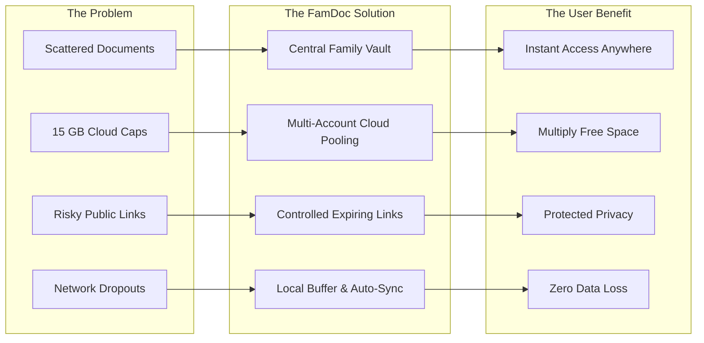

### Problem → Solution → Benefit Matrix

| Challenge | What FamDoc Does | Your Direct Benefit |
|---|---|---|
| **Disorganized family documents** | Provides a structured, nested folder hierarchy and instant search across the whole family. | Find any health card, certificate, or deed in under five seconds from any phone or computer. |
| **Strict 15 GB free storage limits** | Combines multiple free Google Drive accounts into one aggregated storage pool. | If three members each connect an account, the entire family enjoys up to 45 GB of free, unified storage. |
| **Vulnerable file sharing** | Generates temporary, password-protected links with customizable expiry dates and download limits. | Share a file with a doctor or school with complete peace of mind; the link automatically expires when done. |
| **Spotty internet & upload drops** | Employs a dual-tier storage system: files buffer instantly to a local vault and promote to the cloud automatically. | Uploads never fail mid-transit; you get immediate confirmation, and the system handles the sync silently. |
| **Accidental deletions** | Retains removed files in a 30-day protected Recycle Bin before permanent deletion. | Accidental taps or mistaken deletions can be restored instantly with a single click. |

---

## 04 — Key Features & Benefits

FamDoc was designed to feel as effortless as a consumer photo app while maintaining the rigorous protections of an enterprise filing system.

### 🛡️ Private Family Vault & Invitation System
* **What it does:** The family head creates a vault and receives a secure, time-limited 8-character invitation code (e.g., `A7B3C9D2`). Family members use this code to join.
* **Why it matters:** Eliminates messy manual user administration. Only people with your family code can ever enter the vault.
* **Benefit:** Straightforward setup for non-technical parents and children within 60 seconds.

### ☁️ Intelligent Cloud Storage Pooling
* **What it does:** Seamlessly connects multiple Google Drive accounts behind the scenes. When a file is uploaded, the platform automatically directs it to the connected account with the most available free space.
* **Why it matters:** Maximizes free cloud tiers without forcing any family member to manage file distribution manually.
* **Benefit:** Zero manual disk management and significant savings on recurring cloud subscription fees.

### 🔄 Dual-Tier Resilient Storage (Local Vault + Cloud)
* **What it does:** Every file uploaded is immediately saved to a high-speed local disk vault and acknowledged to the user. Background workers then securely transfer the file to Google Drive.
* **Why it matters:** If Google Drive is temporarily rate-limited or your connection fluctuates, your upload never fails.
* **Benefit:** Fast, reliable uploads under all network conditions.

### 🔐 Multi-Tiered Security & Biometrics
* **What it does:** Protects access using strong password cryptography, single-session token validation, and native Android fingerprint/face unlock.
* **Why it matters:** Prevents unauthorized account access even if an old device is left unattended.
* **Benefit:** Seamless, one-touch access on your phone with the assurance that your credentials are safe.

### 🔗 Controlled External Sharing
* **What it does:** Allows members to generate special preview and download links for people outside the family. Links can be password-protected, set to expire in hours or days, or revoked at any time.
* **Why it matters:** You never have to email raw document attachments or send sensitive paperwork over social messaging apps.
* **Benefit:** You maintain complete control over who views your documents, for how long, and how many times.

### 👁️ Instant In-Browser & In-App Previews
* **What it does:** View PDFs, images, and documents directly inside your browser or Android app without downloading them to your local device.
* **Why it matters:** Saves device storage and prevents sensitive documents from accumulating in public or temporary download folders.
* **Benefit:** Immediate, clean viewing on any device.

### 🗑️ 30-Day Recovery Recycle Bin
* **What it does:** Deleted documents are moved to a safety bin where they remain recoverable for 30 days. After 30 days, background clean-up routines securely purge them.
* **Why it matters:** Human error is inevitable. A misplaced tap shouldn't permanently erase an irreplaceable property deed.
* **Benefit:** Complete peace of mind when reorganizing or cleaning up folders.

### 📋 Full Family Activity Timeline
* **What it does:** Keeps a transparent audit trail of major activities (who uploaded what document, who renamed a folder, who generated a share link, and when).
* **Why it matters:** Promotes family transparency and makes it easy to track down recently updated papers.
* **Benefit:** Clear accountability with zero mystery about when records were updated.

---

## 05 — How Was It Created?

FamDoc was designed from the ground up with a **user-first, privacy-focused engineering philosophy**. Rather than stitching together off-the-shelf cloud plugins, the platform was structured to address real household pain points.

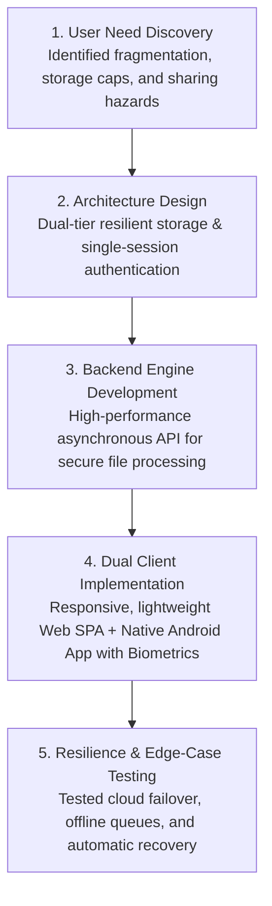

### 1. Identifying the Core Family Workflow
The initial design phase examined how families naturally interact with documents. The workflow demanded:
* A non-technical onboarding process (joining with a simple code).
* Zero technical maintenance (no manual server configurations or drive partitioning).
* A unified experience whether accessed from an Android smartphone, a tablet, or a desktop web browser.

### 2. Crafting the Dual Client Experience
* **The Web Application:** Built as a responsive, zero-overhead Single Page Application (SPA). It loads instantly, requires no heavy browser extensions, adapts seamlessly to mobile or desktop screens, and supports full dark/light aesthetic modes.
* **The Native Android Application:** Engineered natively in modern Kotlin with Jetpack Compose and Material Design 3. It integrates directly with AndroidX Biometrics, allowing family members to unlock their vault with a fingerprint or face scan.

### 3. Engineering the Resilient Storage Engine
Traditional document systems fail when external cloud services experience slowdowns. FamDoc was engineered with an asynchronous backend engine that treats local storage as a fail-safe buffer. If cloud services are unreachable, the system transparently holds the file locally and synchronizes it once connectivity is restored.

### 4. Hardening Security and Privacy
Rather than storing third-party access tokens in plain text, credentials are encrypted using military-grade symmetric encryption. Uploaded files undergo strict format checks and antivirus inspections before entering the vault.

---

## 06 — How It Works

At a high level, FamDoc functions through three interconnected parts that work in perfect harmony:

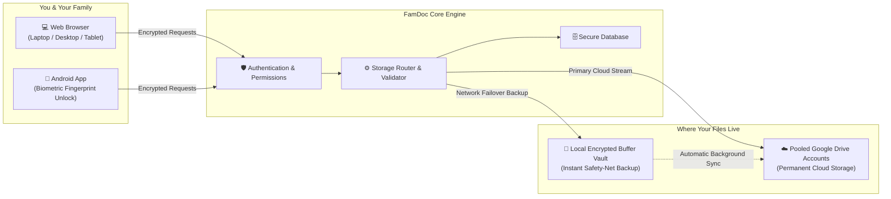

### The Step-by-Step File Journey

Here is what happens when you upload a document to FamDoc:

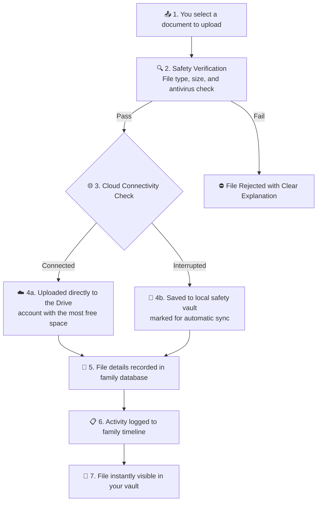

1. **Selection:** You choose a PDF, image, or document on your phone or computer.
2. **Safety Check:** The system verifies that the file is authentic, within allowed limits, and free of known malicious signatures.
3. **Smart Routing:** The system checks connected Google Drive accounts and streams the file to the account with the most available storage.
4. **Resilient Failover:** If the cloud provider is temporarily busy or your connection dips, the file buffers to the local vault without failing.
5. **Confirmation:** The file is cataloged in the family database and immediately appears in your folder.

---

## 07 — How to Use It

Using FamDoc requires no technical knowledge. Here is how a new family gets started:

### Step 1: Create or Join a Vault

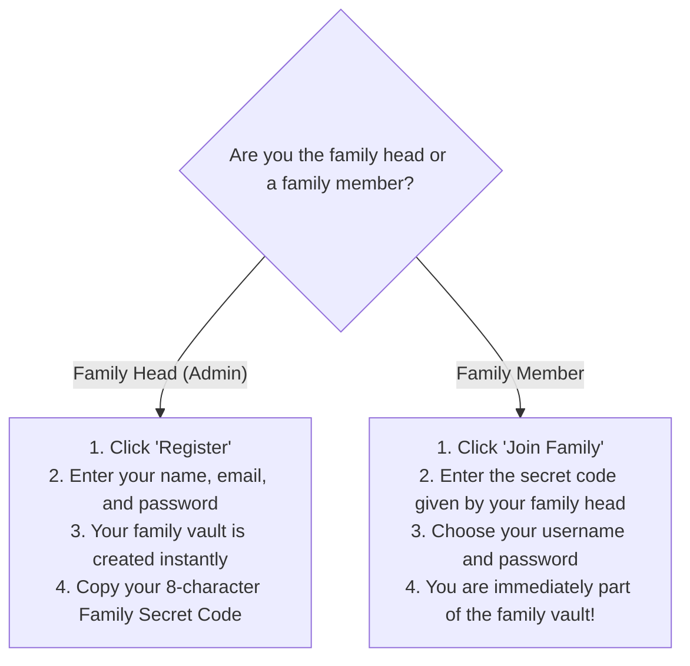

* **Family Admin:** Registers the account, becomes the administrator, and receives a unique 8-character code.
* **Family Members:** Simply enter the 8-character code, choose their credentials, and enter the shared space.

### Step 2: Explore the Dashboard
Once logged in, the **Dashboard** gives an immediate, clear overview:
* Total files and folders in your vault.
* Total used and remaining storage across the family pool.
* Recent uploads and activities by other members.
* Quick-action buttons for uploading and creating folders.

### Step 3: Organize Your Documents
* **Create Folders:** Keep items tidy by creating logical categories (e.g., *Medical Records*, *Insurance*, *Children's School*, *Property Deeds*).
* **Nesting:** Organize deeper as needed (e.g., *Medical Records → Dad → 2026*).
* **Upload:** Drag and drop files from your desktop or select them from your Android phone's gallery/file picker.

### Step 4: Preview and Download
* **Previewing:** Click any PDF or image to view it immediately in full screen.
* **Downloading:** Click the download icon to save a pristine copy directly to your device.

### Step 5: Sharing Outside the Family
Need to show an insurance card to a clinic or send a transcript to an admissions office?
1. Select the file and click **Share**.
2. Optionally add an **access password** and select an **expiration time** (e.g., 24 hours, 7 days).
3. Copy the generated link and send it via WhatsApp, SMS, or email.
4. When the recipient opens the link, they view or download only that specific file. You can revoke the link at any moment.

### Step 6: Restoring Deleted Items
If a file was deleted by mistake:
1. Open the **Trash** from the navigation bar.
2. Locate the file and click **Restore**.
3. It immediately reappears in its original folder.

---

## 08 — Trust & Security

We believe that true security comes from **transparency and disciplined design**, not exaggerated marketing buzzwords. FamDoc implements a defense-in-depth security model across every layer of the platform.

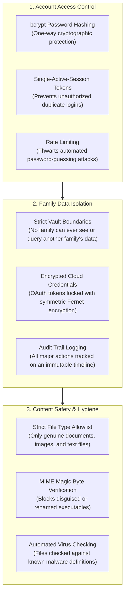

### Security Measures in Plain English

#### 1. Password Protection
Your passwords are never stored in readable form. They are scrambled using **bcrypt**, an industry-standard one-way cryptographic hashing function. Even if someone inspected the database directly, your actual password cannot be reversed or retrieved.

#### 2. Single-Session Enforcement
To safeguard against unattended devices or stolen credentials, FamDoc enforces a single-active-session policy. If your account is signed in on a new device, any older active session is automatically retired.

#### 3. Strict Family Isolation
The architecture enforces strict multi-tenancy. Every file, folder, and activity log is permanently bound to your specific family identifier. There is no shared cross-family index, making cross-tenant data leakage impossible.

#### 4. Credential Encryption
Connected cloud storage accounts require access tokens. FamDoc protects these sensitive tokens using **Fernet symmetric encryption**. They are never saved in plain text and are decrypted only in-memory when communicating with cloud storage APIs.

#### 5. Deep File Verification & Antivirus Checks
To prevent users from inadvertently uploading malicious software:
* Files are validated by inspecting their internal "magic bytes" (header signatures), ensuring that a disguised script cannot be renamed to `.pdf`.
* Uploads are scanned against known malware databases before storage.

#### 6. Honest Boundaries & Realistic Expectations
> [!NOTE]
> No software on Earth can claim to be "100% unhackable." FamDoc's security relies on robust, proven industry patterns, strict isolation, and transparent auditing. We encourage users to use strong, unique passwords and enable biometric screen locks on their personal devices.

---

## 09 — Real-World Use Cases

Here are common ways families rely on FamDoc every day:

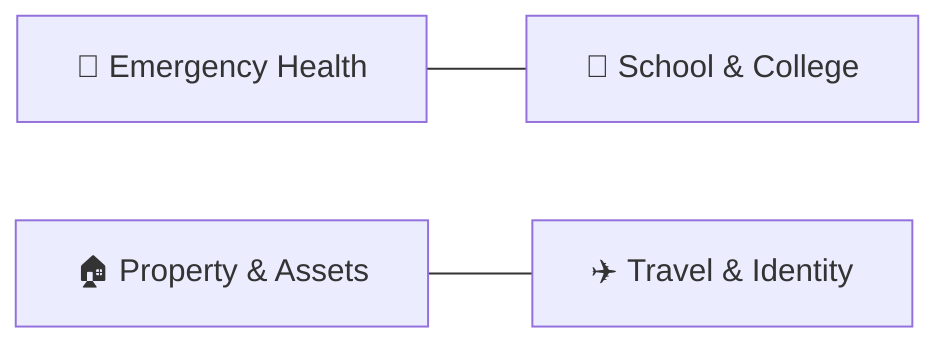

### 1. The Emergency Medical Run
* **Scenario:** A family member is admitted to an urgent care clinic while traveling.
* **Challenge:** The attending doctor needs previous allergy records and recent prescription histories immediately.
* **How FamDoc Helps:** Any family member opens the FamDoc app on their phone, authenticates with their fingerprint, searches "Allergies", and displays the records directly to the physician in seconds.

### 2. College & School Admissions
* **Scenario:** A teenager is applying to multiple universities requiring birth certificates, previous grade cards, and immunization records.
* **Challenge:** Parents are at work and cannot search through paper filing cabinets at home.
* **How FamDoc Helps:** The student logs into the family vault from their laptop, navigates to their folder, and downloads certified PDF copies directly.

### 3. Property & Vehicle Management
* **Scenario:** A homeowner needs to submit house tax receipts and home insurance policy numbers for an annual assessment.
* **Challenge:** Receipts from several different years are scattered across paper envelopes and old email threads.
* **How FamDoc Helps:** All tax receipts and insurance certificates reside in a dedicated *Property* folder, sorted by year, with immediate in-browser preview.

### 4. Controlled Sharing with Outside Professionals
* **Scenario:** A chartered accountant needs past salary slips and investment proofs to file tax returns.
* **Challenge:** Sending financial records over WhatsApp or standard email creates unmanaged, persistent digital copies.
* **How FamDoc Helps:** The user creates a share link for the tax folder, sets an expiration period of 48 hours and a secret PIN, and texts the link to the accountant. Access automatically shuts down after two days.

---

## 10 — Key Benefits at a Glance

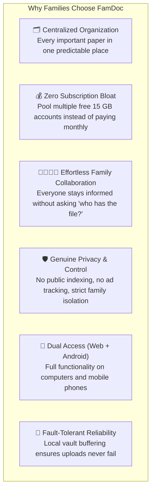

* **Effortless Organization:** End document scavenger hunts forever with clean nested folders and instant keyword search.
* **Substantial Cost Savings:** Multiply your free storage by aggregating accounts rather than paying $20–$100 annually for cloud upgrades.
* **Complete Independence:** Your documents remain under your family's control, shielded from third-party social algorithms and public search engines.
* **Cross-Device Availability:** Enjoy a lightweight web experience on desktops and laptops, alongside a native Android app with biometric unlock.
* **Safety from Mistakes:** The 30-day Recycle Bin ensures an accidental deletion never results in a permanent loss.

---

## 11 — Current Status & Limitations

In the spirit of complete transparency, here is a clear summary of what FamDoc currently does and the current technical boundaries:

### What Is Working Today
* ✅ Full-featured web application (works on all modern desktop and mobile browsers).
* ✅ Native Android application with Jetpack Compose UI and biometric fingerprint authentication.
* ✅ Multi-account Google Drive storage pooling with automated capacity routing.
* ✅ Local vault failover buffering and silent background synchronization.
* ✅ Family invite code generation and instant member onboarding.
* ✅ Nested folder creation, renaming, moving, and instant search.
* ✅ 30-day soft-delete Recycle Bin with single-click restoration.
* ✅ External share link generator with optional password protection and expiration timers.
* ✅ Deep file format validation and automated malware checks.
* ✅ Single-active-session management and brute-force rate limiting.

### Current System Boundaries & Limitations
* **Maximum File Size:** Individual file uploads are currently capped at **50 MB per file**. This ensures rapid processing and prevents bandwidth saturation on standard server tiers.
* **Document Types:** Optimized for documents and media (PDF, JPEG, PNG, DOCX, XLSX, TXT). Executable binaries, system archives, and application scripts are intentionally blocked for security reasons.
* **Archival Focus:** FamDoc is an archival and document management vault. It is not an in-browser collaborative word processor (like Google Docs live multi-cursor editing).
* **Cloud Dependency:** Cloud storage pooling currently integrates with Google Drive accounts. Other providers (such as OneDrive or Dropbox) are planned for future versions.

---

## 12 — Future Roadmap

We are continuously evolving FamDoc to make family life simpler and more secure. Here is a look at our roadmap:

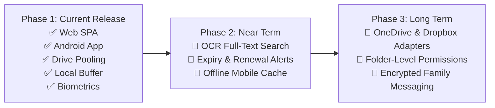

### 🔍 Phase 2 (Near Term)
* **Smart OCR (Optical Character Recognition):** Automatically index text inside scanned PDFs and photos, allowing you to search for words printed *inside* a document, not just in the filename.
* **Document Expiry & Renewal Reminders:** Set expiration dates on passports, vehicle insurance, and warranties to receive timely email reminders before they lapse.
* **Offline Mobile Pinning:** Pin critical documents inside the Android app for offline viewing when traveling without internet access.

### 🌐 Phase 3 (Future Horizons)
* **Expanded Cloud Storage Providers:** Add support for Microsoft OneDrive, Dropbox, and self-hosted S3-compatible cloud vaults.
* **Granular Folder Permissions:** Allow parents to create private sub-folders (such as *Financial Investments*) that are restricted from children's accounts within the same family vault.

---

## 13 — Frequently Asked Questions (FAQ)

### What makes FamDoc different from standard Google Drive?
Google Drive is built for individual accounts. When you share files on Google Drive, storage counts against one person's 15 GB quota, permissions can become messy, and files remain scattered across different owners. FamDoc creates a **centralized family vault** that pools multiple accounts together, provides a shared family trash bin, and includes an offline-resilient local buffer.

### Do all family members need their own Google accounts?
No. Only the family admin needs to connect Google Drive accounts to establish the storage pool. Regular family members simply create a FamDoc username and password using the family secret code; they do not need their own Google Drive connected to upload or view files.

### Can someone outside our family view our files?
No. All files and activity are strictly isolated to your family vault. The only way an outsider can view a document is if a family member explicitly generates an external share link for that specific file.

### What happens if our internet connection drops while uploading?
FamDoc was engineered specifically to handle poor connectivity. The platform saves your file to a local encrypted safety vault immediately and confirms the upload. Once your connection stabilizes, a background sync worker quietly promotes the file to your Google Drive pool.

### Can I use FamDoc on an iPhone or iPad?
Yes. While the native app is built for Android, FamDoc's web application is a responsive Single Page Application that works smoothly in Safari, Chrome, and Firefox on iOS, iPadOS, macOS, Windows, and Linux.

### What happens if I accidentally delete a document?
Nothing is immediately destroyed. The file moves to the family **Recycle Bin**, where it remains safely for 30 days. Any family member can restore it back to its original location with a single click.

### How does the external share link protect my document?
When creating a share link, you can require a custom password, set an expiration window (e.g., 24 hours), or cancel the link at any time. Recipients only receive access to preview or download that single file—they cannot view your vault or any other family files.

---

### 🎯 FamDoc: Protecting What Matters Most to Your Family

**Built with care, security, and simplicity by Akshaysinh Rajput**

*Designed for households, parents, and caregivers who value their family's privacy and digital heritage.*

