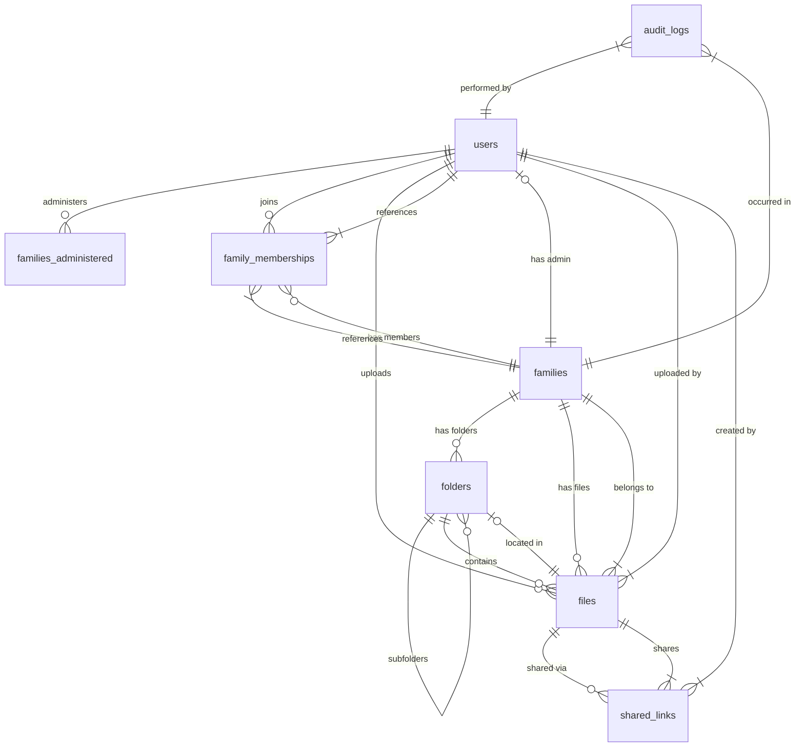
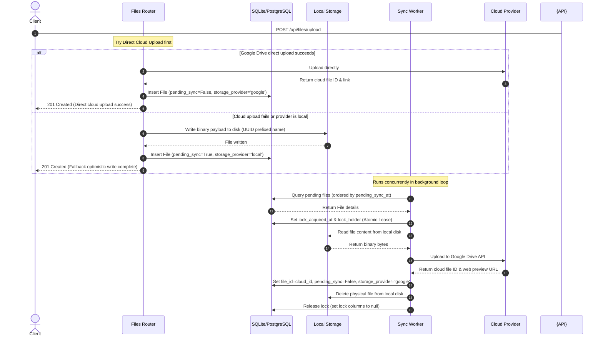
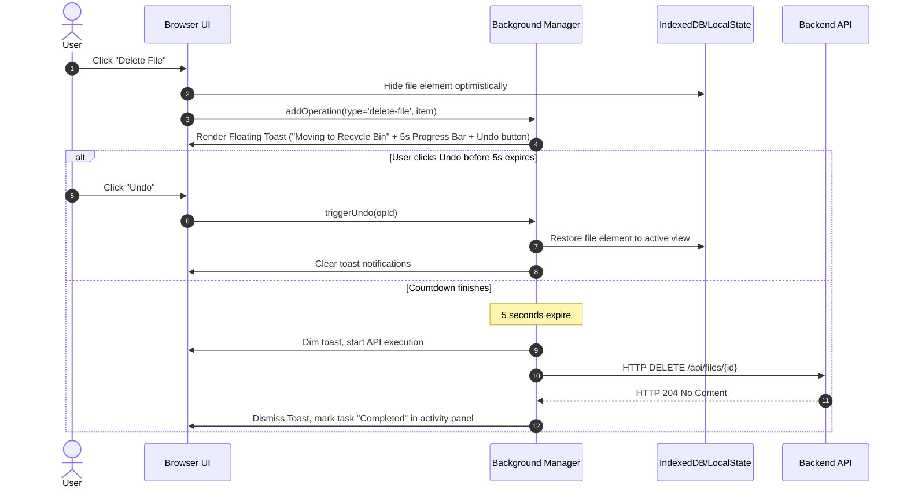

# Family Document Management System (FDMS) - Deep Project Explanation

The **Family Document Management System (FDMS)** (internally referred to as **FamilyVault** or **FamDoc**) is a full-stack, secure, and resilient document management platform designed for families. It provides a shared storage space where members can upload, organize, and preview files.

The application is built around a **Dual-Tier Resilient Storage** paradigm:
*   **Direct Cloud Write:** Files are uploaded directly to the family's configured Google Drive space when available to minimize latency and server overhead.
*   **Resilient Local-First Fallback:** If Google Drive is slow, unreachable, or configured in local mode, files are written instantly to the local server disk, and a background thread handles promotion to the cloud when connections restore.

---

## 1. High-Level Architecture

The project is architected with a decoupled structure consisting of a **Python FastAPI backend** and a **Vanilla HTML/CSS/JS frontend**.

```mermaid
graph TD
    SubGraphFrontend[Frontend Client (Vercel / Static)]
    SubGraphBackend[Backend API Server (FastAPI / Render)]
    SubGraphDb[(Database: SQLite / Supabase PostgreSQL)]
    SubGraphCloud[Google Drive Storage]
    
    SubGraphFrontend -- HTTPS Requests --> SubGraphBackend
    SubGraphBackend -- Queries & Transactions --> SubGraphDb
    
    subgraph Storage Managers
        SubGraphBackend -- Direct Upload / Download --> SubGraphCloud
        SubGraphBackend -- Fallback Write Local --> LocalVault[(Local Storage Disk)]
        Worker[Background Sync Worker] -- Promotes Local Files --> SubGraphCloud
        SubGraphBackend -- Fetches Credentials --> SubGraphDb
    end
    
    SubGraphCloud --> GoogleDrive[Google Drive API]
```

### Decoupled Routing Patterns
To connect the frontend client and the backend server when hosted across different domain names:
*   **Option A (Proxy Rewrite):** A proxy setup defined in [`vercel.json`](../frontend/vercel.json) redirects all `/api/*` requests on the frontend domain to the backend server domain. This naturally bypasses Cross-Origin Resource Sharing (CORS) security issues and allows cookies and tokens to be handled seamlessly.
*   **Option B (Direct CORS Requests):** The frontend sets `API_BASE_URL` in [`api.js`](../frontend/js/api.js) to the backend API domain, while the backend configures `CORS_ORIGINS` in [`config.py`](../backend/config.py) to allow requests from the frontend domain.

---

## 2. Database Schema & Data Dictionary

FDMS uses an ORM database layer (powered by **SQLAlchemy**). During development, it runs on a local **SQLite** database, optimizing sqlite speed using Write-Ahead Logging (`PRAGMA journal_mode=WAL`). For production, it seamlessly connects to a persistent database (e.g. **Supabase PostgreSQL**). 

Here is the schema relationships visualization:



### Table Specifications

#### 1. `users`
Represents registered users in the system.
*   `id` (Integer, PK): Auto-incrementing unique user ID.
*   `username` (String(50)): Unique username.
*   `email` (String(255)): Unique email address.
*   `password_hash` (String(255), Nullable): bcrypt hashed password (nullable for members registered by admins without immediate passwords).
*   `role` (String(50)): Role of the user (`admin` or `member`).
*   `current_token_jti` (String(64), Nullable): Unique token identifier (`jti`) of the most recently issued active JWT token, used for single-session enforcement.
*   `created_at` (DateTime): Account registration timestamp.

#### 2. `families`
Represents family vault groups.
*   `id` (String(36), PK): UUID representing the unique Family ID.
*   `name` (String(255)): Display name of the family vault.
*   `admin_id` (Integer, FK -> `users.id`, Cascades on delete): ID of the user who manages this family vault.
*   `secret_code_hash` (String(255)): Salted password hash for members to join this family.
*   `secret_code_sha256` (String(64), Unique, Indexed, Nullable): SHA256 hashed code, indexed for quick join checks.
*   `max_members` (Integer): Maximum member quota (default 10).
*   `storage_provider` (String(50), Nullable): Selected cloud destination (`local` or `google`).
*   `_storage_config` (Encrypted String(2048), Nullable): Fernet-encrypted JSON credentials for the family's Google accounts.
*   `vault_folder_id` (String(255), Nullable): Root folder identifier created inside the cloud provider.
*   `storage_quota_bytes` (Integer): Storage space limit in bytes (default 500MB).
*   `created_at` (DateTime): Creation timestamp.
*   `expires_at` (DateTime, Nullable): Expiry timestamp for subscriptions.

#### 3. `family_members`
Association table connecting users to a family group.
*   `id` (Integer, PK): Unique link ID.
*   `family_id` (String(36), FK -> `families.id`, Cascades on delete): Associated Family ID.
*   `user_id` (Integer, FK -> `users.id`, Cascades on delete): Associated User ID.
*   `role` (String(50)): User's role inside the family.
*   `joined_at` (DateTime): Membership timestamp.
*   *Constraint:* Unique index on `(family_id, user_id)` prevents double-memberships.

#### 4. `folders`
Represents hierarchical directories inside the shared family vault.
*   `id` (Integer, PK): Folder index ID.
*   `name` (String(255)): Directory folder name.
*   `parent_id` (Integer, FK -> `folders.id`, Cascades on delete, Nullable): Self-referential ID of the parent folder (null means root directory).
*   `family_id` (String(36), FK -> `families.id`, Cascades on delete): Vault ownership scope.
*   `created_at` (DateTime): Directory creation timestamp.
*   `deleted_at` (DateTime, Nullable): Soft-delete timestamp (null = active folder).
*   `deletion_batch_id` (String(36), Nullable): Group identifier used to restore recursive trees in bulk.
*   `cloud_folder_id` (String(255), Nullable): Cloud provider folder ID.
*   `google_drive_folder_id` (String(255), Nullable): Google Drive folder ID.

#### 5. `files`
Tracks documents uploaded into the vault.
*   `id` (Integer, PK): File identifier.
*   `filename` (String(255)): User-visible file name.
*   `file_type` (String(100)): MIME content type.
*   `size_bytes` (Integer): File size in bytes.
*   `uploader_id` (Integer, FK -> `users.id`, Nulls on delete, Nullable): Uploader user reference.
*   `folder_id` (Integer, FK -> `folders.id`, Cascades on delete, Nullable): Containing folder.
*   `family_id` (String(36), FK -> `families.id`, Cascades on delete): Family scope.
*   `upload_date` (DateTime): Upload timestamp.
*   `deleted_at` (DateTime, Nullable): Soft-delete timestamp.
*   `deletion_batch_id` (String(36), Nullable): Group identifier for trash bin tracking.
*   `storage_provider` (String(50)): Tracks where the file is currently stored (`local` or `google`).
*   `_file_id` (String(255), Nullable): Legacy file ID column.
*   `local_file_id` (String(255), Nullable): Unique filename on local disk.
*   `cloud_file_id` (String(255), Nullable): Unique file identifier on Google Drive.
*   `google_drive_file_id` (String(255), Nullable): Specifically stores Google Drive file ID.
*   `primary_storage` (String(50), Nullable): Backup preference storage target.
*   `backup_status` (String(50), Nullable): Backup sync state.
*   `cloud_link` (String(1024), Nullable): Direct link to preview/download from Google Drive.
*   `pending_sync` (Boolean): Flag designating if the file is awaiting promotion to the cloud.
*   `pending_sync_at` (DateTime, Nullable): Timestamp of when the file was registered for synchronization.
*   `synced_to` (String(50), Nullable): Identifies target cloud provider (`google` or None).
*   `lock_acquired_at` (DateTime, Nullable): Lock lease timestamp for background sync safety.
*   `lock_holder` (String(255), Nullable): Hostname/worker identifier currently leasing this file.
*   `sync_retry_count` (Integer): Sync attempts accumulator (maximum of 5 retries).

#### 6. `audit_logs`
System-wide security ledger.
*   `id` (Integer, PK): Unique log ID.
*   `action` (String(50)): Action performed (`LOGIN`, `LOGOUT`, `CREATE_FOLDER`, `DELETE_FOLDER`, `UPLOAD_FILE`, `DELETE_FILE`, `DOWNLOAD_FILE`, etc.).
*   `timestamp` (DateTime): Operation timestamp.
*   `user_id` (Integer, FK -> `users.id`, Nulls on delete, Nullable): User performing the action (null if public link).
*   `family_id` (String(36), FK -> `families.id`, Cascades on delete, Nullable): Vault scope.
*   `ip_address` (String(45), Nullable): IPv4/IPv6 client address.
*   `details` (String(1024), Nullable): Verbose explanation of the action.

#### 7. `shared_links`
Tracks public sharing links.
*   `id` (String(32), PK): Unique token hex identifier.
*   `file_id` (Integer, FK -> `files.id`, Cascades on delete): Shared target file.
*   `family_id` (String(36), FK -> `families.id`, Cascades on delete): Family vault reference.
*   `password_hash` (String(255), Nullable): bcrypt hashed password required to access the shared link.
*   `expires_at` (DateTime, Nullable): Expiration deadline.
*   `max_downloads` (Integer, Nullable): Download access limit.
*   `download_count` (Integer): Current download metric.
*   `created_at` (DateTime): Creation timestamp.
*   `created_by` (Integer, FK -> `users.id`, Nulls on delete, Nullable): User who created the link.

#### 8. `revoked_tokens`
Tracks JSON Web Tokens (JWT) invalidated during logouts.
*   `jti` (String(64), PK): Unique JWT token identifier.
*   `revoked_at` (DateTime): Timestamp of token revocation.

### Database Optimization & Resiliency
*   **WAL Mode & Pragma Settings:** In SQLite mode, the system sets `PRAGMA foreign_keys=ON`, `PRAGMA journal_mode=WAL` (Write-Ahead Logging for high concurrency), `PRAGMA synchronous=NORMAL`, `PRAGMA busy_timeout=5000` (resilience under locks), and `PRAGMA cache_size=-64000` (allocates 64MB memory cache).
*   **PostgreSQL Lock Resolution:** On Supabase PostgreSQL database connections, migrations can fail due to concurrent lock timeouts. The migration runner [database.py](file:///d:/FDMS/backend/database.py) executes a retry loop (up to 3 times) with a 3-second limit. If it times out, it forcefully runs `SELECT pg_terminate_backend(pid)` to kill active blocking transactions before retrying.

---

## 3. Backend System Core Mechanics

### A. Authentication & Scoped JWT Authorization
User authentication runs on **scoped JSON Web Tokens (JWT)**:
1.  **Session Scope (`scope: session`):** Standard token returned upon logging in. Used for all general API endpoints.
2.  **File Preview Scope (`scope: file_preview`):** Short-lived tokens (5-minute expiry) generated on-demand for downloading/previewing files. This allows the system to pass authorization credentials in query parameters (e.g., `<iframe src="/api/files/10/preview?token=..."/>`), which is required because browsers cannot set headers on native iframe URL loading requests.
3.  **Token Revocation Database Blacklist:** On logout, the token's unique ID (`jti`) is persisted in the `revoked_tokens` table. Every authentication check queries this table; if a token is matching, it is blocked immediately.
4.  **Single-Session Enforcement:** On successful login, the new JWT's unique token identifier (`jti`) is stored in the user record (`current_token_jti`). Subsequent API calls verify that the JTI from the client's token matches this value. If a user logs in from a new device/session, the old session JTI is invalidated, immediately locking out the old device.
5.  **Persistent Logins ("Remember Me"):** Implemented by storing JWT credentials and profile cache in the browser's persistent `localStorage` instead of transient `sessionStorage`. This maintains sessions across browser restarts, automatically validating on cold starts.

### B. Resilient Storage Upload & Sync Flow
To ensure rapid uploads, files bypass slow network connection limits to cloud storage by executing locally first:



#### The Background Sync Worker Loop
The backend initiates a dedicated python background thread (`storage-sync-worker` in [main.py](file:///d:/FDMS/backend/main.py)) during startup.
1.  **Lease Acquisition (Distributed Lock):** The worker polls the database for files matching `pending_sync == True`. To prevent double-upload or race conditions across multiple worker processes, it updates the row using an atomic SQL query:
    ```sql
    UPDATE files 
    SET lock_acquired_at = CURRENT_TIMESTAMP, lock_holder = 'worker-id' 
    WHERE id = ? AND pending_sync = 1 AND (lock_acquired_at IS NULL OR lock_acquired_at < EXPIRED_TIME);
    ```
2.  **Google Drive Token Auto-Refresh:** When performing Google Drive API transactions, if the credentials expire, `GoogleDriveProvider` automatically catches it, issues an OAuth POST request to `https://oauth2.googleapis.com/token` to fetch a new access token, updates the family's encrypted `storage_config` field, and commits it back to the database.
3.  **Local Deletion:** Once the file is verified in the cloud, the database details are updated, and the physical local file on disk is deleted to conserve backend server storage space.
4.  **Error Resilience:** If the cloud upload fails, the worker releases the lease lock and increments `sync_retry_count`. If a file fails 5 consecutive times, it is excluded from future runs to prevent a failing file from blocking the queue.
5.  **Cleanups & Startup Recovery:** On server boot, `recover_interrupted_syncs()` parses files where `storage_provider != "local"` but `local_file_id` is still present. This indicates the server crashed/interrupted post-upload but pre-deletion. The startup process cleans up the files from local storage.

### C. Fernet Symmetric Encryption
Since family admins save API credentials (such as Google OAuth Client Secrets) in the database, the system must encrypt them to prevent cleartext exposure:
*   **Method:** Utilizes symmetric encryption via **cryptography.fernet**.
*   **Key Derivation:** Reads `STORAGE_CONFIG_ENCRYPTION_KEY` from the environment. If it doesn't exist, it derives a secure key by passing the `JWT_SECRET` through a SHA-256 hash function and base64-encoding the resulting digest.
*   **Plaintext Fallback:** If key verification fails, the system attempts to parse the database column as raw JSON to ensure backward compatibility with legacy unencrypted rows.

### D. Security Scan & Rate Limiter
*   **VirusTotal API Scanning:** Files uploaded to the system undergo virus scans via the VirusTotal API:
    *   **O(1) Signature Check:** Calculates the file's SHA-256 hash and performs an API lookup. If it matches a known malicious signature (malicious > 0 or suspicious > 1), the upload is rejected.
    *   **Async Background Analysis:** If the file hash is unknown (404), the backend schedules a task via FastAPI's `BackgroundTasks` to upload the raw bytes to VirusTotal for detailed analysis.
*   **Redis-Powered sliding window Rate Limiting:** Rate limiters protect sensitive endpoints (e.g. public share link downloads):
    *   **Sliding Window with ZSET:** Stores client timestamps using Redis Sorted Sets (`rate_limit:{key}`):
        ```redis
        ZREMRANGEBYSCORE rate_limit:key 0 (now - window)
        ZADD rate_limit:key now uuid_member
        ZCARD rate_limit:key
        EXPIRE rate_limit:key window
        ```
    *   **Proxy-Aware IP Extraction:** `backend/utils/ip.py` parses `X-Forwarded-For` (real client IP) or `X-Real-IP` to prevent rate-limit engines from blocking reverse-proxy hosts (e.g., Render/Vercel).
    *   **InMemory Fallback:** If Redis is not available, it uses a thread-safe `InMemoryRateLimiter` using dictionaries protected by a lock.
    *   **Share Password Brute-force Lockout:** If a user fails a share password check 5 times in 10 minutes, they are locked out of downloads for 10 minutes.

### E. Server-Side In-Memory TTL Cache
To reduce SQLite and cloud API lookups, the backend implements a thread-safe caching layer ([cache.py](file:///d:/FDMS/backend/cache.py)):
*   **TTLCache Class:** Implements thread safety using `threading.Lock`. Features an eviction policy that removes expired entries, and evicts the oldest entry (LRU) once `max_size` is exceeded.
*   **Global Partitions:**
    *   `dashboard_cache` (TTL 30s)
    *   `folder_listing_cache` (TTL 15s)
    *   `search_cache` (TTL 10s)
*   **Write Mutation Invalidation:** Any mutation calls (renames, uploads, moves, deletes) trigger `invalidate_family_caches(family_id)`, immediately clearing out related listings and search indexes.

### F. Soft-Deletion & Recursive Trash Recovery
*   **Deletion Batching:** When a folder is deleted, it initiates `soft_delete_folder_recursive()`. This updates all subfolders and files inside the hierarchy with a `deleted_at` timestamp and assigns them a matching `deletion_batch_id` UUID.
*   **Recursive Restoration:** Restoring a folder checks the `deletion_batch_id` of the parent, recursively restoring only the child items that were deleted in that specific batch, preserving other files previously in the recycle bin.
*   **Background Retention Purge:** A background cleanup worker runs daily in [main.py](file:///d:/FDMS/backend/main.py), permanently deleting files and folders soft-deleted more than 30 days ago.

---

## 4. Frontend Architecture & Flow

The frontend is a single-page style interface built on vanilla web standards (HTML5, Vanilla CSS3, Javascript ES6).

```
frontend/
├── css/
│   ├── components.css            # Styles for connections, modals, skeletons, and toasts
│   ├── dashboard.css             # Statistics layout, interactive stat cards
│   ├── layout.css                # Base grid structures and responsive viewport configurations
│   ├── shared-global.css         # Theme colors and global typography properties
│   ├── style.css                 # Premium custom design, glassmorphism, responsive utilities
│   └── vault.css                 # File grid, icons, thumbnails, and preview sheets
├── js/
│   ├── api.js                    # Core fetch wrapper, cache system, global 401 interceptor, error translator
│   ├── app.js                    # Core application lifecycle controller
│   ├── auth.js                   # Handles token saving, logouts, and user session getters
│   ├── background-manager.js     # Manages optimistic UI updates, undo countdowns, activity widget
│   ├── connection-manager.js     # Backend server health checks and request queue manager
│   ├── router.js                 # Router coordinating SPA layout hash hashes
│   ├── theme.js                  # Color theme configuration (dark/light toggles)
│   ├── upload-manager.js         # IndexedDB-backed file uploading queue manager
│   └── views/                    # Separate SPA view render controllers
│       ├── auth.js
│       ├── dashboard.js
│       ├── family.js
│       ├── landing.js
│       ├── profile.js
│       ├── shared.js
│       ├── storage.js
│       ├── trash.js
│       └── vault.js
├── index.html                    # Root HTML file
└── vercel.json                   # Host rewrites routing proxy config
```

### A. IndexedDB-Backed Upload Queue (`upload-manager.js`)
Normal web applications abort uploads if a user navigates away. To provide a premium user experience, FDMS implements an IndexedDB-backed upload queue:
1.  **File Serialization:** When a user drops files into the explorer, the file metadata and raw `File` objects are written to an IndexedDB database named `FamDocUploadsDB`.
2.  **Worker Processing:** The queue manager processes the IndexedDB entries sequentially. It uses standard `XMLHttpRequest` to upload files, monitoring progress percentage to update the UI in real-time.
3.  **Reload Resilience:** If the window is refreshed during an upload, the queue remains saved in IndexedDB. Upon opening the application again, the upload manager automatically picks up where it left off, resuming the upload process.

### B. Optimistic UI & Undo Actions (`background-manager.js`)
To make the application feel highly responsive, deletions utilize an optimistic UI execution design pattern:



1.  **Optimistic Hiding:** When a user deletes a file, the file's UI element is hidden immediately from the file explorer view, and the deletion task is sent to the `BackgroundOperationsManager`.
2.  **Undo Window:** A notification banner displays with a 5-second progress bar countdown and an "Undo" button.
3.  **Rollback Capability:** If the user clicks "Undo", the database update is avoided entirely, the timer is aborted, and the element is immediately restored to the explorer grid.
4.  **Activity Panel Popover:** If the undo window expires, the API request is dispatched to the backend. The floating pill widget updates in the corner of the browser. Clicking the widget reveals a detailed ledger of recent actions, where users can view network failures and select "Retry" for any failed requests.

### C. Cold Start Connection & Request Queueing (`connection-manager.js`)
On serverless/slept hosting environments (e.g., Render's free tier), the backend goes to sleep after inactivity. This causes a cold start delay of 30-50 seconds:
1.  **State Indicator Pill:** A floating connection manager widget displays in the bottom-right corner, transitioning through connection states (`CONNECTING`, `CONNECTED`, `SLOW`, `OFFLINE`, `ERROR`).
2.  **Request Buffering (Queueing):** If any API calls (GET/POST/DELETE) are initiated while the backend is asleep or offline, the client buffers these requests in an in-memory queue instead of allowing them to fail.
3.  **Exponential Backoff & Jitter:** The indicator polls `/api/health` with cache-busting using exponential backoff (starting at 1.5s, doubling up to 15s) and random jitter.
4.  **Auto-Release:** Once the health check succeeds, the connection transitions to `CONNECTED`, all queued requests are released and executed, and the UI indicators fade out.

### D. Client-Side API Caching & Request Deduplication (`api.js`)
To decrease API overhead and ensure instant navigation:
1.  **Response Caching:** Standard GET requests (such as folder structures, files list, and dashboard statistics) are saved in a client-side memory cache with a TTL of 15 seconds.
2.  **Request Deduplication:** If the application triggers concurrent requests for the exact same endpoint, `ApiCache` keeps a single in-flight promise and resolves it for all callers.
3.  **Cache Invalidation on Mutation:** Any mutation call (file upload, rename, folder creation, or deletion) automatically triggers cache invalidation for all directories, files, searches, and dashboard metrics.

### E. Client-Side Thumbnail Rendering & LocalStorage Caching
Loading large files or making multiple requests for previews puts heavy load on cloud/local files storage:
1.  **Canvas-Based Downscaling:** When a file preview image first loads, it is processed via a canvas element, scaled down to a maximum width of 120 pixels, and compressed to a lightweight JPEG (0.6 quality) base64 data URI.
2.  **LocalStorage Persistence:** This compressed thumbnail is saved directly in the client's `localStorage` (`famdoc-image-thumb-{fileId}` or `famdoc-pdf-thumb-{fileId}`). On future visits, this data URI is loaded instantly.
3.  **Quota Protection:** If `localStorage` runs out of space, the cache automatically sweeps older stored thumbnails and attempts to cache the new thumbnail.

### F. Intelligent Auto-Refresh & Synchronization (`FamDocDataSync`)
Data synchronization ensures that the user's active view is always up to date:
*   **Active View Registry:** The current SPA view registers its reload callback to `FamDocDataSync`.
*   **Tab Focus Check:** Listening to the window `focus` event, the sync manager triggers an update if the last synchronization occurred more than 60 seconds ago (stale check).
*   **Event-Driven Syncing:** The sync is automatically fired when the background uploader completes a batch of uploads, or when the connection manager recovers from `OFFLINE` to `CONNECTED`.

---

## 5. Directory Mapping Quick Reference

For developers exploring the codebase:

*   **API Entry Point:** [main.py](file:///d:/FDMS/backend/main.py)
*   **Database Config & Migrations:** [database.py](file:///d:/FDMS/backend/database.py)
*   **Model Schemas:** [models.py](file:///d:/FDMS/backend/models.py)
*   **Model Validation Schemas:** [schemas.py](file:///d:/FDMS/backend/schemas.py)
*   **Serialization Rules:** [serializers.py](file:///d:/FDMS/backend/serializers.py)
*   **Server-Side Cache (`TTLCache`):** [cache.py](file:///d:/FDMS/backend/cache.py)
*   **Client IP Extractor:** [ip.py](file:///d:/FDMS/backend/utils/ip.py)
*   **Symmetric Encryption (Fernet):** [crypto.py](file:///d:/FDMS/backend/utils/crypto.py)
*   **Virus Scanner (VirusTotal):** [virus_scan.py](file:///d:/FDMS/backend/utils/virus_scan.py)
*   **Sliding Window Rate Limiter (Redis):** [rate_limiter.py](file:///d:/FDMS/backend/utils/rate_limiter.py)
*   **Recycle Bin Purge Job:** [cleanup.py](file:///d:/FDMS/backend/utils/cleanup.py)
*   **Storage Routing Manager:** [storage_manager.py](file:///d:/FDMS/backend/storage/storage_manager.py)
*   **Google Drive Integration logic:** [google_drive_provider.py](file:///d:/FDMS/backend/storage/google_drive_provider.py)
*   **Local Storage Provider:** [local.py](file:///d:/FDMS/backend/storage/local.py)
*   **File endpoints router:** [files.py](file:///d:/FDMS/backend/routers/files.py)
*   **Folder endpoints router:** [folders.py](file:///d:/FDMS/backend/routers/folders.py)
*   **Recycle bin router:** [recycle_bin.py](file:///d:/FDMS/backend/routers/recycle_bin.py)
*   **Dashboard router:** [dashboard.py](file:///d:/FDMS/backend/routers/dashboard.py)
*   **Share links router:** [share.py](file:///d:/FDMS/backend/routers/share.py)
*   **Search router:** [search.py](file:///d:/FDMS/backend/routers/search.py)
*   **Storage config router:** [storage_config.py](file:///d:/FDMS/backend/routers/storage_config.py)
*   **Frontend Core Fetch & Cache:** [api.js](file:///d:/FDMS/frontend/js/api.js)
*   **Backend Connection Health Manager:** [connection-manager.js](file:///d:/FDMS/frontend/js/connection-manager.js)
*   **IndexedDB Sync Upload logic:** [upload-manager.js](file:///d:/FDMS/frontend/js/upload-manager.js)
*   **Optimistic UI Manager:** [background-manager.js](file:///d:/FDMS/frontend/js/background-manager.js)
*   **Frontend Stylesheet:** [style.css](file:///d:/FDMS/frontend/css/style.css)
