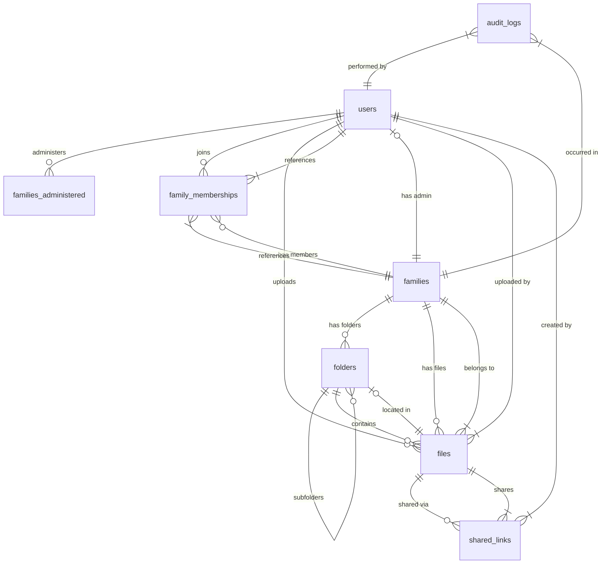
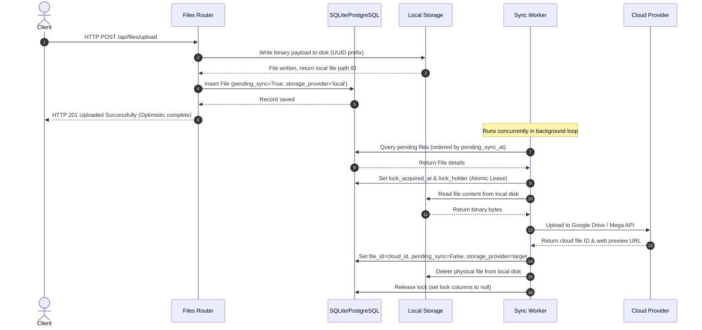
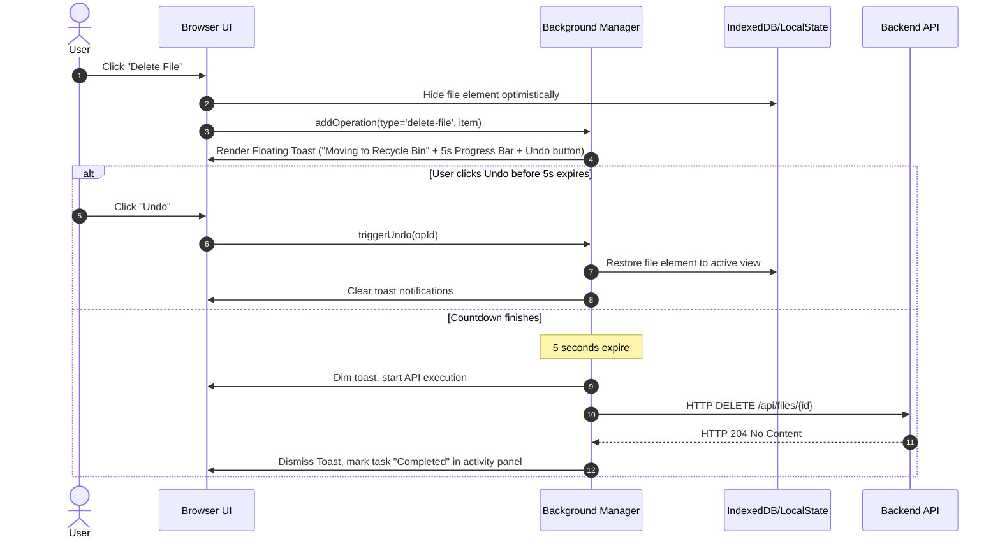

# Family Document Management System (FDMS) - Deep Project Explanation

The **Family Document Management System (FDMS)** (internally referred to as **FamilyVault** or **FamDoc**) is a full-stack, secure, and resilient document management platform designed for families. It provides a shared storage space where members can upload, organize, and preview files. 

The application is designed around a **Local-First Write with Background Cloud Promotion** paradigm. This guarantees that file uploads are instant and independent of external cloud latency or outage, while ensuring long-term persistence in the family's preferred cloud storage (Google Drive or Mega.nz).

---

## 1. High-Level Architecture

The project is architected with a decoupled structure consisting of a **Python FastAPI backend** and a **Vanilla HTML/CSS/JS frontend**.

```mermaid
graph TD
    SubGraphFrontend[Frontend Client (Vercel / Static)]
    SubGraphBackend[Backend API Server (FastAPI / Render)]
    SubGraphDb[(Database: SQLite / Supabase PostgreSQL)]
    SubGraphCloud[Cloud Storage Provider]
    
    SubGraphFrontend -- HTTPS Requests --> SubGraphBackend
    SubGraphBackend -- Queries & Transactions --> SubGraphDb
    
    subgraph Storage Managers
        SubGraphBackend -- Read/Write Local --> LocalVault[(Local Storage Disk)]
        Worker[Background Sync Worker] -- Promotes Local Files --> SubGraphCloud
        SubGraphBackend -- Fetches Credentials --> SubGraphDb
    end
    
    SubGraphCloud --> GoogleDrive[Google Drive API]
    SubGraphCloud --> Mega[Mega.co.nz]
```

### Decoupled Routing Patterns
To connect the frontend client and the backend server when hosted across different domain names:
*   **Option A (Proxy Rewrite):** A proxy setup defined in [vercel.json](file:///d:/FDMS/frontend/vercel.json) redirects all `/api/*` requests on the frontend domain to the backend server domain. This naturally bypasses Cross-Origin Resource Sharing (CORS) security issues and allows cookies and tokens to be handled seamlessly.
*   **Option B (Direct CORS Requests):** The frontend sets `API_BASE_URL` in [api.js](file:///d:/FDMS/frontend/js/api.js) to the backend API domain, while the backend configures `CORS_ORIGINS` in [config.py](file:///d:/FDMS/backend/config.py) to allow requests from the frontend domain.

---

## 2. Database Schema & Data Dictionary

FDMS uses an ORM database layer (powered by **SQLAlchemy**). During development, it runs on a local **SQLite** database, optimizing sqlite speed using Write-Ahead Logging (`PRAGMA journal_mode=WAL`). For production, it seamlessly connects to a persistent database (e.g. **Supabase PostgreSQL**). 

Here is the schema relationships visualization:



### Table Specifications

#### 1. `users`
Represents registered users.
*   `id` (Integer, PK): Auto-incrementing unique user ID.
*   `username` (String): Unique username.
*   `email` (String): Unique email.
*   `password_hash` (String): bcrypt hashed password (nullable for members registered by admins without immediate passwords).
*   `role` (String): Role of the user (`admin` or `member`).
*   `created_at` (DateTime): Account registration timestamp.

#### 2. `families`
Represents the family vault groups.
*   `id` (String(36), PK): UUID representing the unique Family ID.
*   `name` (String): Display name of the family vault.
*   `admin_id` (Integer, FK): ID of the user who manages this family vault (Cascades on delete).
*   `secret_code_hash` (String): Salted password hash for members to join this family.
*   `secret_code_sha256` (String): SHA256 hashed code, indexed for quick join checks.
*   `max_members` (Integer): Subscription quota or size limit (default 10).
*   `storage_provider` (String): Selected cloud destination (`google` or `mega`).
*   `storage_config` (Encrypted JSON): Fernet-encrypted credentials for the family's Google/Mega accounts.
*   `vault_folder_id` (String): Root folder identifier created inside the cloud provider.

#### 3. `family_members`
Association table connecting users to a family group.
*   `id` (Integer, PK): Unique link ID.
*   `family_id` (String(36), FK): Associated Family ID.
*   `user_id` (Integer, FK): Associated User ID.
*   `role` (String): User's role inside the family.
*   `joined_at` (DateTime): Membership timestamp.

#### 4. `folders`
Represents hierarchical directories inside the shared family vault. Supports nested structures.
*   `id` (Integer, PK): Folder index ID.
*   `name` (String): Directory folder name.
*   `parent_id` (Integer, FK): Self-referential ID of the parent folder (null means root directory).
*   `family_id` (String(36), FK): Vault ownership scope.
*   `deleted_at` (DateTime): Soft-delete timestamp (null = active folder).
*   `deletion_batch_id` (String): Group identifier used to restore recursive trees in bulk.

#### 5. `files`
Tracks documents uploaded into the vault.
*   `id` (Integer, PK): File identifier.
*   `filename` (String): User-visible file name.
*   `file_type` (String): MIME content type.
*   `size_bytes` (Integer): File size in bytes.
*   `uploader_id` (Integer, FK): Uploader user reference.
*   `folder_id` (Integer, FK): Containing folder (null means root directory).
*   `family_id` (String(36), FK): Family scope.
*   `deleted_at` (DateTime): Soft-delete timestamp.
*   `deletion_batch_id` (String): Group identifier for trash bin tracking.
*   `storage_provider` (String): Tracks where the file is currently stored (`local`, `google`, or `mega`).
*   `file_id` (String): Unique identifier of the file on disk (local filename contains UUID prefix) or cloud file ID.
*   `cloud_link` (String): Direct link to preview/download from Google Drive.
*   `pending_sync` (Boolean): Boolean flag designating if the file is awaiting promotion to the cloud.
*   `pending_sync_at` (DateTime): Timestamp of when the file was registered for synchronization.
*   `synced_to` (String): Identifies target cloud provider (`google` or `mega`).
*   `lock_acquired_at` (DateTime): Lock lease timestamp for background sync safety.
*   `lock_holder` (String): Hostname/worker identifier currently leasing this file.
*   `sync_retry_count` (Integer): Sync attempts accumulator (maximum of 5 retries before failure lockout).

#### 6. `audit_logs`
System-wide security ledger.
*   `id` (Integer, PK): Unique log ID.
*   `action` (String): Actions performed (`LOGIN`, `LOGOUT`, `UPLOAD_FILE`, `DELETE_FILE`, `DOWNLOAD_FILE`, etc.).
*   `timestamp` (DateTime): Operation timestamp.
*   `user_id` (Integer, FK): User performing the action.
*   `family_id` (String(36), FK): Vault scope where the action occurred.
*   `ip_address` (String): IPv4/IPv6 client address.
*   `details` (String): Verbose explanation of the action.

#### 7. `shared_links`
Tracks public sharing links.
*   `id` (String(32), PK): Unique token hex identifier.
*   `file_id` (Integer, FK): Shared target file.
*   `family_id` (String(36), FK): Family vault reference.
*   `password_hash` (String): Optional bcrypt hashed password required to access the shared link.
*   `expires_at` (DateTime): Expiration deadline.
*   `max_downloads` (Integer): Download access limit.
*   `download_count` (Integer): Current download metric.
*   `created_by` (Integer, FK): User who created the link.

#### 8. `revoked_tokens`
Tracks JSON Web Tokens (JWT) invalidated during logouts.
*   `jti` (String(64), PK): Unique JWT token identifier.
*   `revoked_at` (DateTime): Timestamp of token revocation.

---

## 3. Backend System Core Mechanics

### A. Authentication & Scope-Based Authorization
FastAPI handles user authentication with **scoped JSON Web Tokens (JWT)**.
1.  **Session Scope (`scope: session`):** Standard token returned upon logging in. Used for all general API endpoints.
2.  **File Preview Scope (`scope: file_preview`):** Short-lived tokens (5-minute expiry) generated on-demand for downloading/previewing files. This allows the system to pass authorization credentials in query parameters (e.g., `<iframe src="/api/files/10/preview?token=..."/>`), which is required because browsers cannot set headers on native iframe URL loading requests.
3.  **Token Revocation Database Blacklist:** On logout, the token's unique ID (`jti`) is persisted in the `revoked_tokens` table. Every authentication check queries this table; if a token is matching, it is blocked immediately.

### B. Local-First Write & Background Cloud Sync
To optimize performance, file uploads bypass slow network connection limits to cloud storage by executing locally first:



#### The Background Sync Worker Loop
The backend initiates a dedicated python background thread (`storage-sync-worker` in [main.py](file:///d:/FDMS/backend/main.py)) during startup.
1.  **Lease Acquisition (Distributed Lock):** The worker polls the database for files matching `pending_sync == True`. To prevent double-upload or race conditions across multiple worker processes, it updates the row using an atomic SQL query:
    ```sql
    UPDATE files 
    SET lock_acquired_at = CURRENT_TIMESTAMP, lock_holder = 'worker-id' 
    WHERE id = ? AND pending_sync = 1 AND (lock_acquired_at IS NULL OR lock_acquired_at < EXPIRED_TIME);
    ```
2.  **Provider Routing:** The worker resolves which provider is configured. If both Google Drive and Mega credentials are saved, Google Drive is chosen as the primary target. If the chosen provider is offline (tested using a 3-second network health check ping), the worker releases the lease lock and falls back to check the other provider.
3.  **Local Deletion:** Once the file is verified in the cloud, the database details are updated, and the physical local file on disk is deleted to conserve backend server storage space.
4.  **Error Resilience:** If the cloud upload fails, the worker releases the lease lock and increments `sync_retry_count`. If a file fails 5 consecutive times, it is excluded from future runs to prevent a failing file from blocking the queue.

### C. Fernet Symmetric Encryption
Since family admins save API credentials (such as Google OAuth Client Secrets and Mega passwords) in the database, the system must encrypt them to prevent cleartext exposure.
*   **Method:** Utilizes symmetric encryption via **cryptography.fernet**.
*   **Key Derivation:** Reads `STORAGE_CONFIG_ENCRYPTION_KEY` from the environment. If it doesn't exist, it derives a secure key by passing the `JWT_SECRET` through a SHA-256 hash function and base64-encoding the resulting digest.
*   **Properties:** Config configurations are dynamically encrypted on write (using custom SQL-Alchemy property setters) and decrypted on read.

### D. Security Scan & Rate Limiter
*   **VirusTotal API Scanning:** Files uploaded to the system undergo virus scans via the VirusTotal API. To avoid slow network uploads during requests, the system first calculates the file's SHA-256 hash and performs an O(1) hash lookup query to VirusTotal.
    *   If the file hash matches a known malicious signature, the upload is rejected.
    *   If the file hash is unknown (404), the backend accepts the file but schedules a background task to upload and analyze the full file content, alerting administrators if a threat is flagged later.
*   **Pluggable Rate Limiting:** The backend secures endpoints (especially public share page downloads) with rate limiters. It dynamically connects to **Redis** (using a sliding-window algorithm via Sorted Sets) if a `REDIS_URL` is available, falling back to a lock-safe **InMemory** dictionary timestamp database if Redis is absent.

---

## 4. Frontend Architecture & Flow

The frontend is a single-page style interface built on vanilla web standards (HTML5, Vanilla CSS3, Javascript ES6).

```
frontend/
├── css/
│   └── style.css                 # Premium custom design, glassmorphism, responsive utilities
├── js/
│   ├── api.js                    # Core fetch wrapper, global 401 interceptor, error translator
│   ├── auth.js                   # Handles token saving, logouts, and user session getters
│   ├── background-manager.js     # Manages optimistic UI updates, undo countdowns, activity widget
│   └── upload-manager.js         # IndexedDB-backed file uploading queue manager
├── index.html                    # Root landing dispatcher
├── login.html                    # User sign in page
├── register.html                 # Sign up page (Admin or Member joining)
├── dashboard.html                # Vault statistics, recent actions, audit logging review
├── files.html                    # Vault explorer (folders creation, file uploads, actions)
├── family.html                   # Members administration page
├── profile.html                  # User profile and password updating
├── storage-config.html           # Admin page for setting up Google Drive / Mega
└── shared.html                   # Public download page for links shared outside the family
```

### A. IndexedDB-Backed Upload Queue (`upload-manager.js`)
Normal web applications abort uploads if a user navigates away or refreshes the page. To provide a premium user experience, FDMS implements an IndexedDB-backed upload queue:
1.  **File Serialization:** When a user selects files or drops them into the explorer, the file metadata and raw **Blob/File** binary content are written to an IndexedDB database named `FamDocUploadsDB`.
2.  **Worker Processing:** A queue manager processes the IndexedDB entries sequentially. It uses standard `XMLHttpRequest` to upload files, monitoring progress percentage to update the UI in real-time.
3.  **Reload Resilience:** If the window is refreshed or closed during an upload, the queue state remains saved in IndexedDB. Upon opening the application again, the upload manager automatically picks up where it left off, resuming the upload process.

### B. Optimistic UI & Undo Actions (`background-manager.js`)
To make the application feel highly responsive, deletions utilize an optimistic UI execution design pattern:



1.  **Optimistic Hiding:** When a user deletes a file, the file's UI element is hidden immediately from the file explorer view, and the deletion task is sent to the `BackgroundOperationsManager`.
2.  **Undo Window:** A notification banner displays with a 5-second progress bar countdown and an "Undo" button.
3.  **Rollback Capability:** If the user clicks "Undo", the database update is avoided entirely, the timer is aborted, and the element is immediately restored to the explorer grid.
4.  **Activity Panel Popover:** If the undo window expires, the API request is dispatched to the backend. The floating pill widget (`All activities completed` or `Running 1 action...`) updates in the corner of the browser. Clicking the widget reveals a detailed ledger of recent actions, where users can view network failures and select "Retry" for any failed requests.

---

## 5. Directory Mapping Quick Reference

For developers exploring the codebase:

*   **API Entry Point:** [main.py](file:///d:/FDMS/backend/main.py)
*   **Database Config & Migrations:** [database.py](file:///d:/FDMS/backend/database.py)
*   **Model Schemas:** [models.py](file:///d:/FDMS/backend/models.py)
*   **Storage Routing Manager:** [storage_manager.py](file:///d:/FDMS/backend/storage/storage_manager.py)
*   **Google Drive Integration logic:** [google_drive_provider.py](file:///d:/FDMS/backend/storage/google_drive_provider.py)
*   **Mega NZ Integration logic:** [mega_provider.py](file:///d:/FDMS/backend/storage/mega_provider.py)
*   **File endpoints router:** [files.py](file:///d:/FDMS/backend/routers/files.py)
*   **Frontend Stylesheet:** [style.css](file:///d:/FDMS/frontend/css/style.css)
*   **IndexedDB Sync Upload logic:** [upload-manager.js](file:///d:/FDMS/frontend/js/upload-manager.js)
*   **Optimistic UI Manager:** [background-manager.js](file:///d:/FDMS/frontend/js/background-manager.js)
